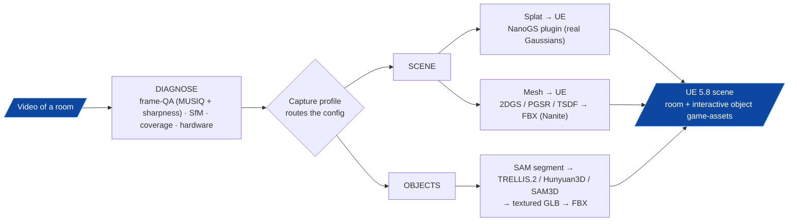
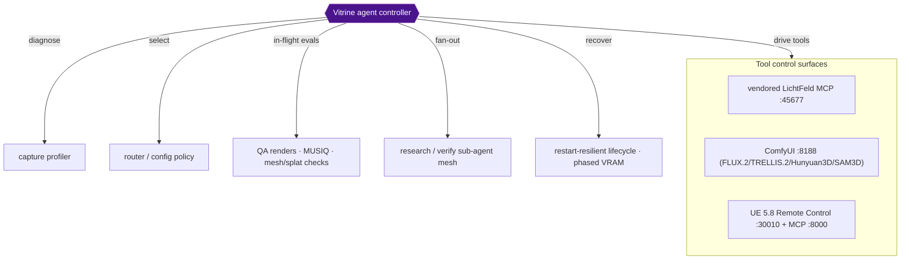
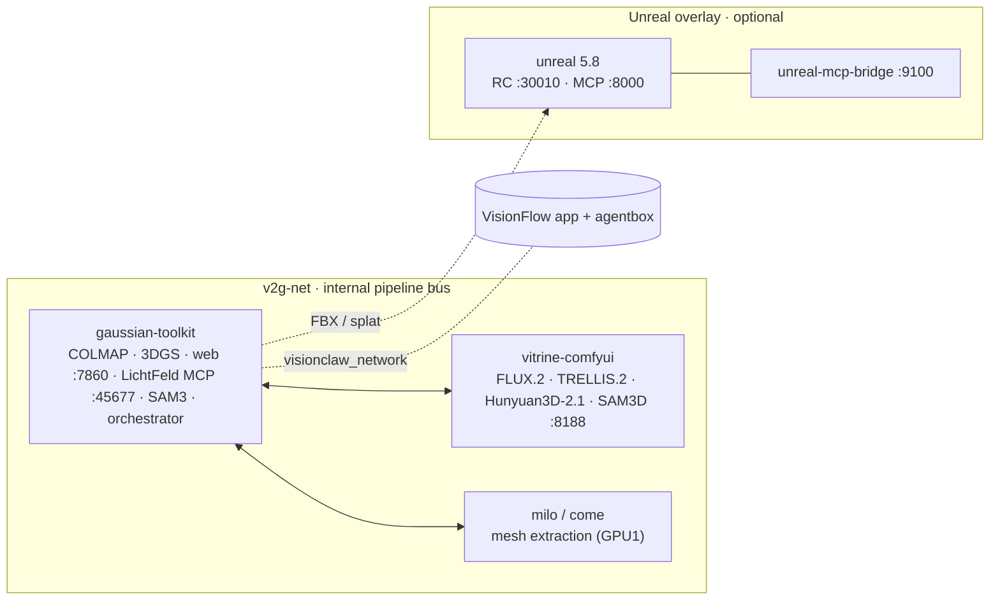

<div align="center">

# Vitrine

**Turn ordinary video of a real space into a structured, textured, game-ready 3D scene in Unreal Engine 5.8.**

*A capture-adaptive, agent-orchestrated video → 3D → game-engine pipeline.*

</div>

---

Point Vitrine at video of a room and its contents. It produces an **Unreal Engine 5.8** scene: the
**room** — as a real Gaussian splat *and/or* a clean polygonal mesh — populated with **individually
reconstructed, correctly-placed, textured object meshes** imported as game-style assets (FBX with
baked-texture materials, Nanite-ready). An optional compressed `.ksplat` targets the web.

Vitrine is **not a single fixed pipeline**. Real captures fail in different ways — motion blur, sparse
coverage, holes, no depth sensor — so Vitrine **diagnoses each capture and routes it to the reconstruction
path that best fits its bottleneck.** There is no universal "best path"; the best path is a function of the
data.

> **LichtFeld is a tool, not the trunk.** Vitrine vendors [LichtFeld Studio](https://github.com/MrNeRF/LichtFeld-Studio)
> as a **pinned dependency** (`vendor/lichtfeld-studio` @ `v0.5.3`) for native 3DGS training, rendering and
> its local MCP control surface. Vitrine is a standalone project that *calls* LichtFeld — it is no longer a
> fork. See [LichtFeld as a vendored tool](#lichtfeld-as-a-vendored-tool).

---

## The capture-adaptive multi-pipeline



The router selects from a menu of validated components plus capture-conditional enhancers (ArtiFixer for
floaters/holes, deblur for blur, densification for sparse coverage). **The authoritative design — the full
router, the option matrix, and the research behind each choice — lives in
[`docs/asset-creation-decision-tree.md`](docs/asset-creation-decision-tree.md).**

| Stage | What runs |
|---|---|
| **Ingest + QA** | Frame extraction → MUSIQ NR-IQA + full-res Laplacian sharpest-per-window selection |
| **Structure** | COLMAP SfM (ALIKED + LightGlue) |
| **3DGS** | LichtFeld native trainer (vendored) / CoMe / gsplat |
| **Scene → splat** | LichtFeld `.ply` → SuperSplat clean → **NanoGS** (UE 5.8, real Gaussians) |
| **Scene → mesh** | **2DGS / PGSR** (SOTA surface) or TSDF → texture-bake (xatlas) → FBX |
| **Objects** | SAM3 concept-segment → **TRELLIS.2** `hull_e2e` (primary) / Hunyuan3D-2.1 / SAM3D → textured GLB → FBX |
| **Enhancers** *(capture-conditional)* | ArtiFixer (floaters/holes) · deblur · densification |
| **Delivery** | UE 5.8 game-asset import (Nanite); embed object FBXs in the room; proxy collision; in-browser `.ksplat` viewer |

## Agentic internal controller *(evolving toward)*

Vitrine is moving from scripted stages to an **internal agent controller** that owns the run end-to-end:



The controller **diagnoses** the capture, **selects** the pipeline config, **drives** each tool through its
control surface, runs **in-flight evaluations** and **recovers** (restart-resilient model lifecycles, phased
VRAM), and **fans out sub-agent meshes** to choose SOTA components and adversarially verify results before
committing. The control surfaces already exist (the vendored LichtFeld MCP, ComfyUI, UE Remote Control / MCP);
the controller is the orchestration layer growing on top of them.

## Docker landscape

A consolidated GPU stack plus optional sidecars, wired over two networks. The host owns/rebuilds the GPU
containers; the agent controller drives them by service name.



| Container | GPU | Purpose |
|---|---|---|
| `gaussian-toolkit` | 0 | COLMAP, 3DGS, web UI, **vendored LichtFeld MCP**, Blender, SAM3, pipeline orchestrator |
| `vitrine-comfyui` | 0 | Owner ComfyUI — FLUX.2 / TRELLIS.2 / Hunyuan3D-2.1 / SAM3D |
| `milo` / `come` | 1 | Mesh extraction backends |
| `unreal` *(overlay)* | 1 | UE 5.8 — splat/mesh assembly + render |
| `unreal-mcp-bridge` *(overlay)* | — | HTTP proxy `:9100` over the UE control surfaces |

**Ports:** web `:7860` · ComfyUI `:8188` · LichtFeld MCP `:45677` · onboarding wizard `:8088` ·
UE Remote Control `:30010` · UE MCP `:8000` · bridge `:9100`.
**Networks:** `v2g-net` (internal bus) · `visionclaw_network` (shared with the VisionFlow app + agentbox).

## LichtFeld as a vendored tool

LichtFeld Studio is a native C++23/CUDA 3DGS workstation. Vitrine **pulls it in as a pinned tool** rather than
forking it:

```
vendor/lichtfeld-studio/   ← git submodule, pinned @ v0.5.3 (native 3DGS train / render / MCP)
```

- We **never modify** the vendored tool; we **update it by bumping the submodule tag**.
- LichtFeld's local **MCP server** is the primary interface for driving native 3DGS — see [`AGENTS.md`](AGENTS.md).
- The UE-delivery path deliberately uses **our** mesh/splat → FBX/NanoGS pipeline (LichtFeld's native USD
  export emits a `ParticleField` UE cannot import — see `research/decisions/`).

## Repository layout

```
Vitrine/
├── src/pipeline/     ← the Python pipeline (capture QA → SfM → 3DGS → mesh/splat → objects → UE)
├── src/web/          ← Flask web UI (:7860): ingest, run browser with previews, embedded 3D splat viewer, per-run zip
├── scripts/          ← pipeline tooling, mesh/splat/UE drivers, bridges
├── unreal/           ← self-contained UE 5.8 overlay (engine, runtime, NanoGS plugin, Dockerfiles)
├── onboarding/       ← Rust/Axum exhibit-manifest wizard (:8088)
├── docker/           ← stack Dockerfiles + entrypoints (gaussian-toolkit / comfyui / milo / come)
├── docs/             ← architecture, workflows, the capture-adaptive decision tree
├── research/         ← ADRs + work orders (SOTA-selection traceability)
└── vendor/
    └── lichtfeld-studio/   ← vendored 3DGS tool (submodule @ v0.5.3)
```

## Web UI features

The Flask web service (`src/web/`, `:7860`) is loopback-only (`127.0.0.1`) and reached via SSH tunnel
(ADR-022). Three features consolidated from the ArchiveSpace community PR (ADR-023):

- **File browser with previews** — per-run output tree (`/api/runs/<id>/tree`) with range-served image,
  mesh, and splat previews; frame listing with thumbnails.
- **Per-run zip download** — streamed, constant-memory zip of each run's assets
  (`/api/runs/<id>/zip`); the legacy `/download/<job_id>` route is preserved.
- **3D splat viewer** — hybridises `@mkkellogg/gaussian-splats-3d` with Vitrine's `.ksplat` output
  and the existing `/viewer` route; served from `/api/scenes/<id>/splat/<filename>` (range + ETag).

See `research/decisions/adr-023-*.md` for the full contract and security analysis.

## Status

Dreamlab end-to-end is the active reference run:
- **Objects** — met via TRELLIS.2 `hull_e2e` (chair / vacuum / toolbox).
- **Room** — capture-limited (motion blur) as a *mesh*; delivered faithfully as a **splat** via the
  recompiled **NanoGS** UE 5.8 plugin; a **2DGS** surface mesh is the polygonal-asset alternative.
- **Capture quality is the dominant bottleneck** — see `docs/capture-methodology.md`.

Live status: [`docs/engineering-log.md`](docs/engineering-log.md).

## Build & run

Prerequisites and the full build are in [`docs/build/`](docs/build/). Common entry points:

```bash
git clone --recurse-submodules <this-repo>                  # pulls the vendored LichtFeld tool
docker compose -f docker-compose.consolidated.yml up -d     # bring up the stack
ssh -N -L 7860:localhost:7860 <user>@<rig>                  # then open http://localhost:7860 (ADR-022: loopback-only)
scripts/run_comfyui.sh                                       # owner ComfyUI
python -m pipeline.sota_registry check                       # SOTA preflight (weights/VRAM/pins)
```

## License

GPL-3.0 (derivative work of LichtFeld Studio, GPL-3.0). Model weights carry their own licenses; Vitrine is a
non-commercial research project and selects models accordingly.
