<div align="center">

# Vitrine

**Turn ordinary capture of a real space into a structured, textured, game-ready 3D scene in Unreal Engine 5.8.**

*A capture-adaptive, agent-orchestrated photo/video → 3D → game-engine pipeline for cultural-heritage digitisation.*

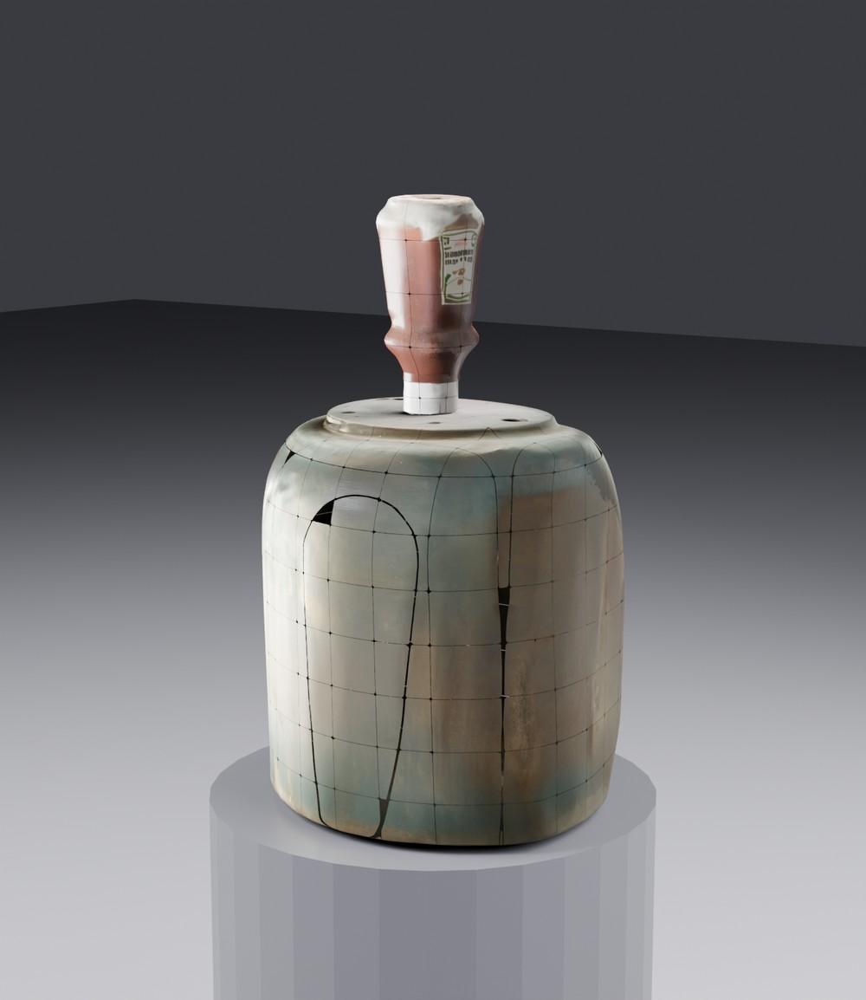 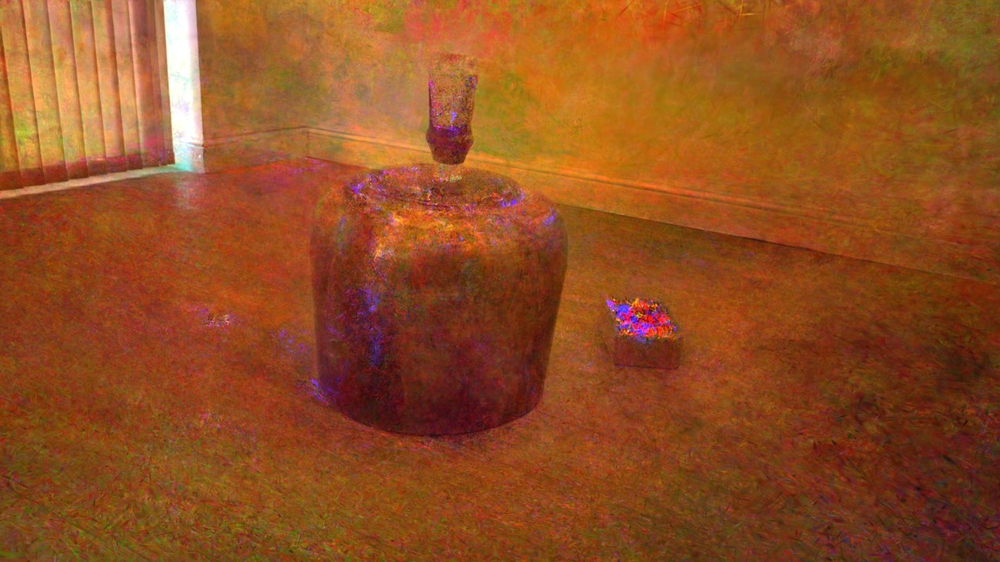

<sub>Left: a real object (brass vessel + ketchup bottle) reconstructed from photos into a textured, metadata-tagged game asset. Right: the captured room as a native 3D Gaussian splat. Both from one 55-frame phone capture — see the <a href="#results--the-rawcapdev-end-to-end-run">end-to-end run</a>.</sub>

</div>

---

Point Vitrine at photos or video of a room and its contents. It produces an **Unreal Engine 5.8** scene: the
**room** — as a real Gaussian splat *and/or* a clean polygonal mesh — populated with **individually
reconstructed, correctly-placed, textured object meshes** imported as game-style assets (FBX/GLB with
baked-texture materials, Nanite-ready) and carrying `v2g:*` lineage metadata. An optional compressed
`.ksplat` targets the web.

Vitrine is **not a single fixed pipeline**. Real captures fail in different ways — motion blur, sparse
coverage, holes, no depth sensor — so Vitrine **diagnoses each capture and routes it to the reconstruction
path that best fits its bottleneck.** There is no universal "best path"; the best path is a function of the
data.

It runs as a **single hardened on-premises Docker image** — data-sovereign, air-gappable, and reachable only
over an SSH tunnel — so sensitive collections never leave the institution. See [Security posture](#security-posture).

> **LichtFeld is a tool, not the trunk.** Vitrine vendors [LichtFeld Studio](https://github.com/MrNeRF/LichtFeld-Studio)
> as a **pinned dependency** (`vendor/lichtfeld-studio` @ `v0.5.3`) for native 3DGS training, rendering and
> its local MCP control surface. Vitrine is a standalone project that *calls* LichtFeld — it is no longer a
> fork. See [LichtFeld as a vendored tool](#lichtfeld-as-a-vendored-tool).

---

## The capture-adaptive multi-pipeline

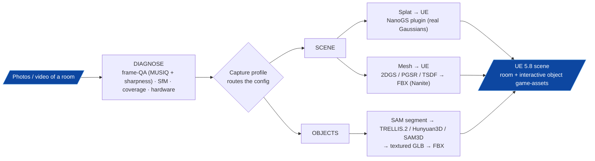

The router selects from a menu of validated components plus capture-conditional enhancers (ArtiFixer for
floaters/holes, deblur for blur, densification for sparse coverage). **The authoritative design — the full
router, the option matrix, and the research behind each choice — lives in
[`docs/asset-creation-decision-tree.md`](docs/asset-creation-decision-tree.md).**

| Stage | What runs |
|---|---|
| **Ingest + QA** | DNG/HEIC decode (camera-WB) → MUSIQ NR-IQA + full-res Laplacian sharpest-per-window selection |
| **Structure** | COLMAP SfM (SIFT; ALIKED+LightGlue target — see work-order) |
| **3DGS** | LichtFeld native trainer (vendored, `igs+`) / CoMe / gsplat |
| **Scene → splat** | LichtFeld `.ply` → SuperSplat clean → **NanoGS** (UE 5.8, real Gaussians) |
| **Scene → mesh** | 2DGS / PGSR (research target; shipped surface backends: TSDF, CoMe/MILo) → texture-bake (xatlas) → FBX |
| **Objects** | SAM3 concept-segment → **TRELLIS.2** image→3D (primary) / Hunyuan3D-2.1 / SAM3D → 4096 PBR-textured GLB → FBX |
| **Enhancers** *(capture-conditional)* | ArtiFixer (floaters/holes) · deblur · densification |
| **Delivery** | UE 5.8 game-asset import (Nanite); embed object FBXs in the room; proxy collision; in-browser `.ksplat` viewer |

## Results — the `rawcapdev` end-to-end run

The pipeline was validated end-to-end (2026-07-02) on **55 hand-held Pixel DNG frames** of a gallery
still-life: a brass patina vessel with an inverted Heinz ketchup bottle. One capture yields both a room
splat and a reconstructed, textured, staged object.

**1 — Decode fixes colour at the source.** Camera white-balance on DNG decode removes the daylight-WB orange
cast that would otherwise propagate into the splat and every object crop:

<div align="center">
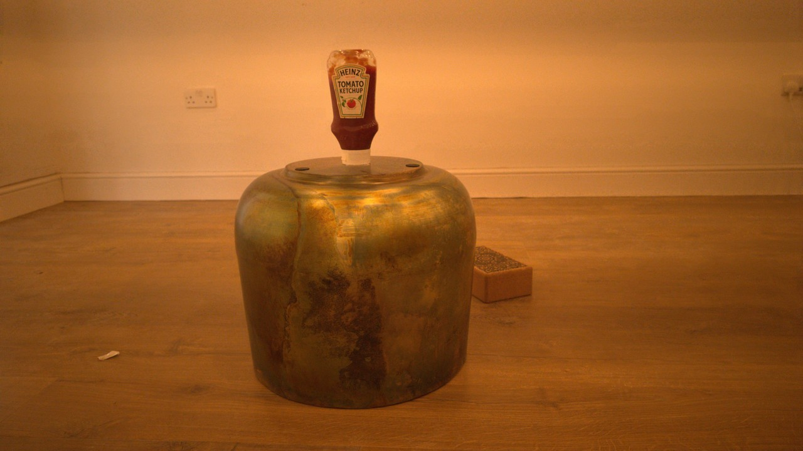 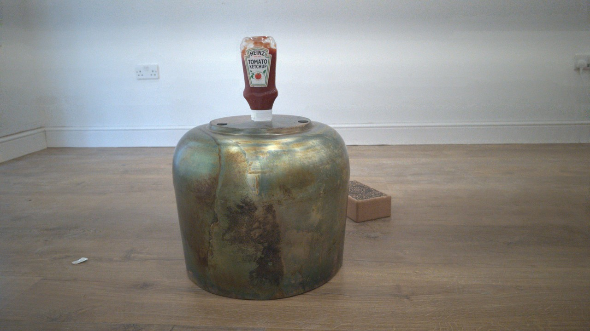
<br/><sub>Before (libraw default) → after (<code>use_camera_wb</code>): neutral gallery walls.</sub>
</div>

**2 — Room → native Gaussian splat.** COLMAP registered **100 %** of frames (10.4k points); LichtFeld `igs+`
trained GPU-bound (~15 min, 30k iters) to a 4-million-Gaussian splat:

<div align="center">
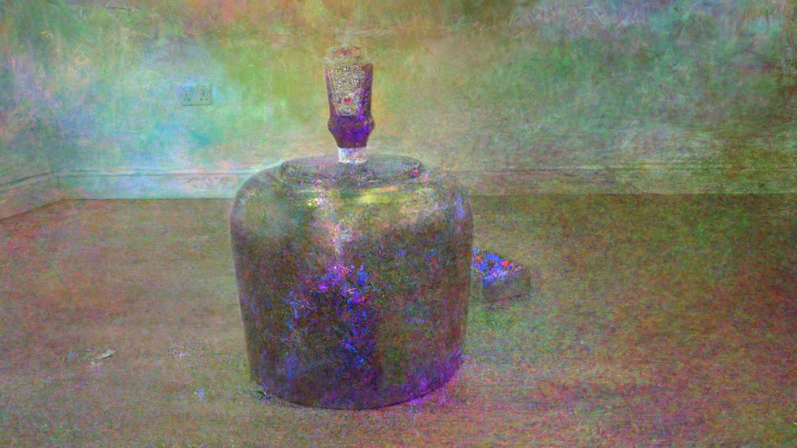 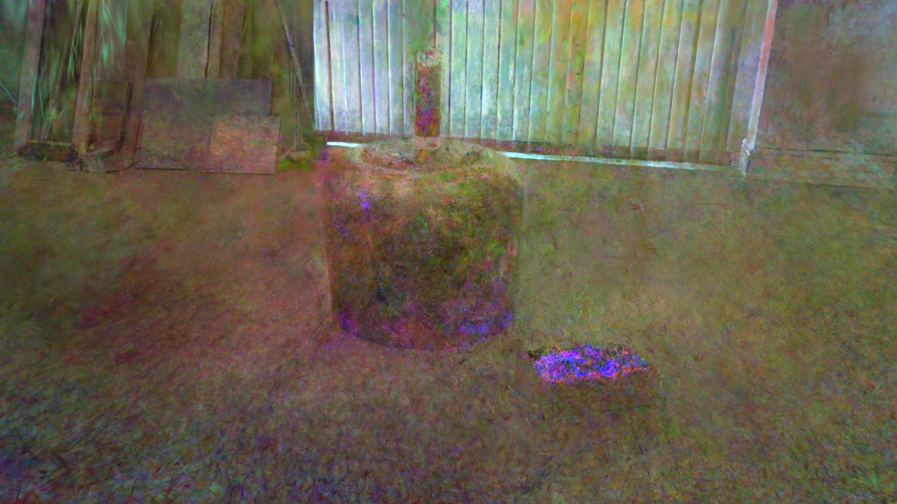 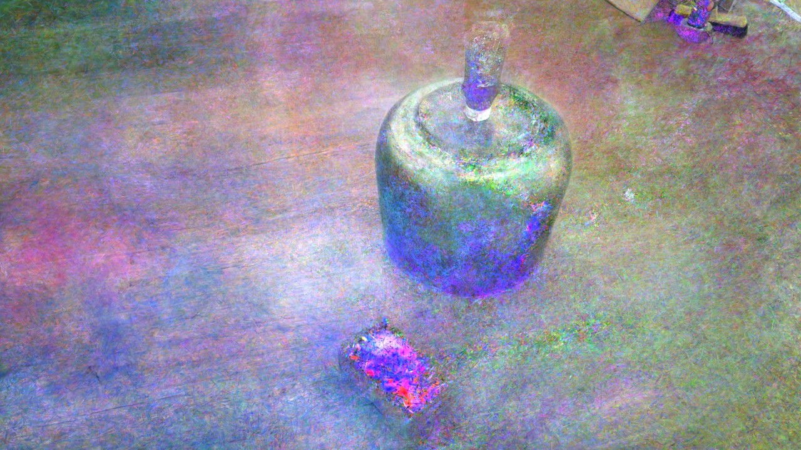
</div>

**3 — Object → textured game asset.** A SAM crop of the hero object fed to **TRELLIS.2 image→3D** produces a
274k-vertex mesh with a 4096 PBR texture, staged with `v2g:*` metadata on a plinth and rendered in Blender:

<div align="center">
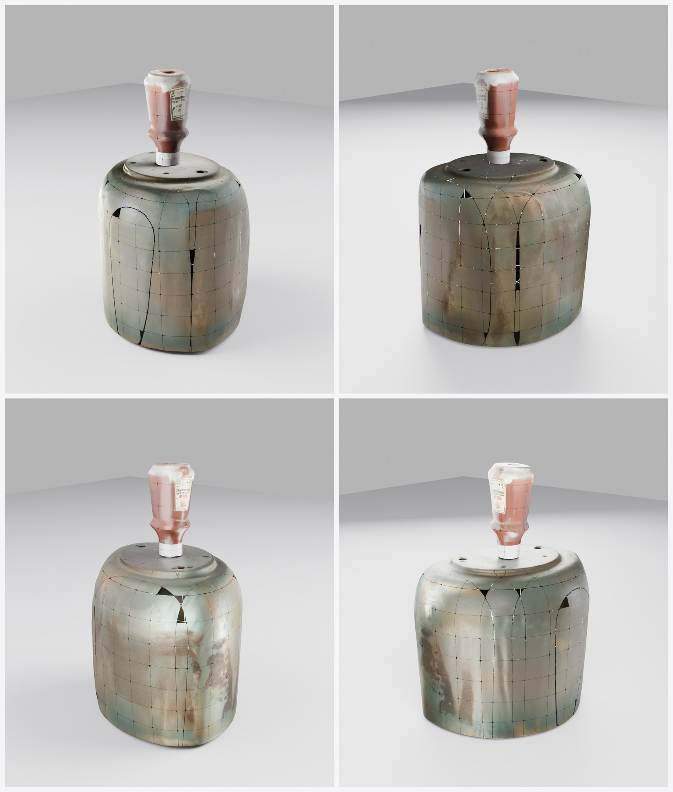 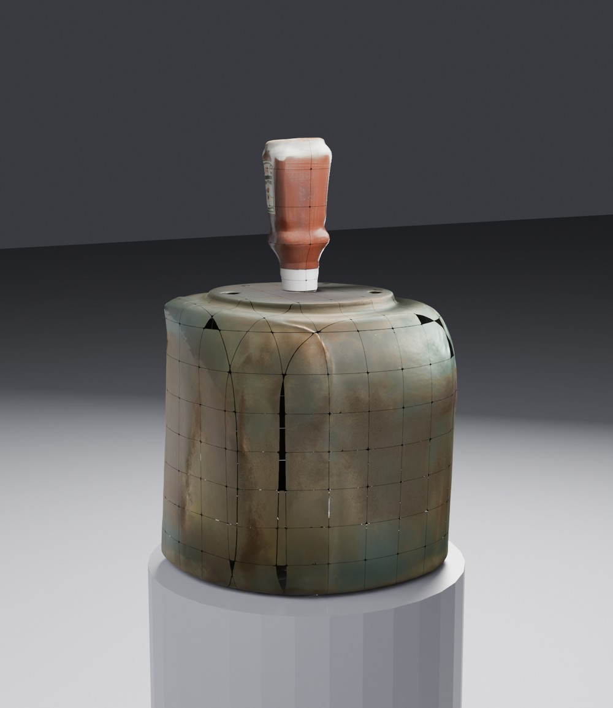
</div>

Full E2E record: [`docs/pipeline-e2e-validation-2026-07-02.md`](docs/pipeline-e2e-validation-2026-07-02.md) ·
keeper renders: [`docs/renders/rawcapdev-2026-07-02/`](docs/renders/rawcapdev-2026-07-02/).

## Agentic internal controller

Vitrine is moving from scripted stages to an **internal agent controller** that owns the run end-to-end
(today that controller is the **Claude Code CLI subprocess**, driven by `CLAUDE_CONTAINER.md`, not yet a
bespoke orchestrator class):

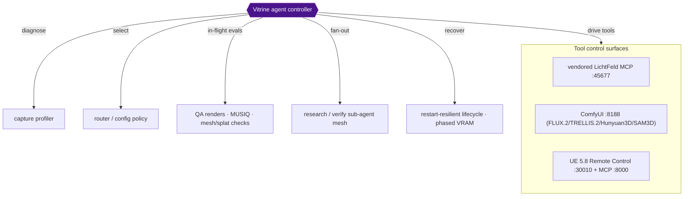

The controller **diagnoses** the capture, **selects** the pipeline config, **drives** each tool through its
control surface, runs **in-flight evaluations**, and **recovers** (restart-resilient model lifecycles, phased
VRAM). It **fans out sub-agent meshes** to choose SOTA components and adversarially verify results before
committing — the same pattern used to build and self-heal this platform (e.g. an adversarial QE fleet caught a
non-functional API wiring bug before it shipped; a self-healing entrypoint rebuilds a CUDA extension when a
pinned wheel's ABI drifts). This is **automated, risk-managed continuous improvement**: every change is
proposed, verified, and only then committed.

## Docker landscape

A consolidated GPU stack plus optional sidecars, wired over two networks. The host owns/rebuilds the GPU
containers; the agent controller drives them by service name.

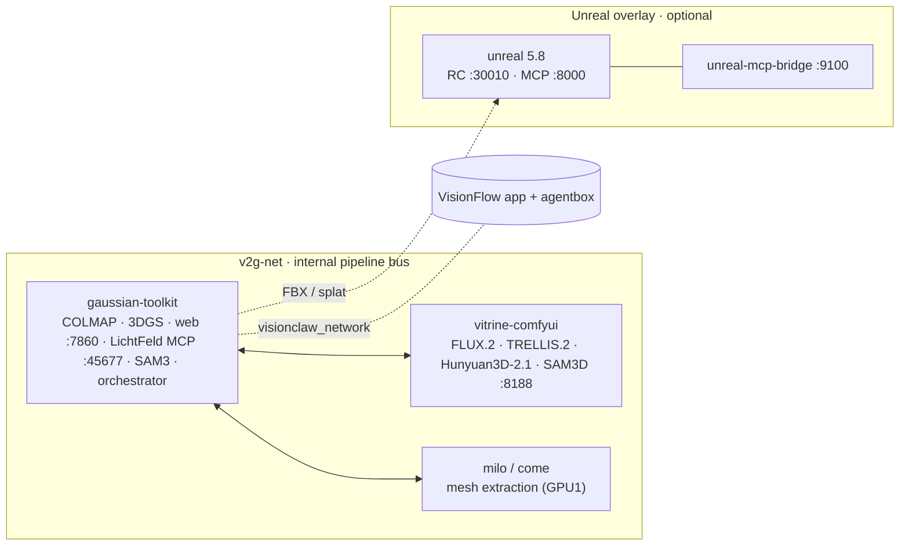

| Container | GPU | Purpose |
|---|---|---|
| `gaussian-toolkit` | 0 | COLMAP, 3DGS, web UI, **vendored LichtFeld MCP**, Blender, SAM3, pipeline orchestrator |
| `vitrine-comfyui` | 0 | Owner ComfyUI — FLUX.2 / TRELLIS.2 / Hunyuan3D-2.1 / SAM3D |
| `milo` / `come` | 1 | Mesh extraction backends |
| `unreal` *(overlay)* | 1 | UE 5.8 — splat/mesh assembly + render |
| `unreal-mcp-bridge` *(overlay)* | — | HTTP proxy `:9100` over the UE control surfaces |

**Ports:** web `:7860` · ComfyUI `:8188` · LichtFeld MCP `:45677` · onboarding wizard `:8088` ·
UE Remote Control `:30010` · UE MCP `:8000` · bridge `:9100`.
**Networks:** `v2g-net` (internal bus) · `visionclaw_network` (shared with the VisionFlow app + agentbox).

## Security posture

Vitrine is designed to pass institutional IT review and to hold sensitive or unpublished collections safely.

- **Primary hardened image + sidecars.** `gaussian-toolkit` is one primary hardened image, but it is not the
  entire runtime: the GPU-1 batch sidecars (`milo`, `come`, ArtiFixer), `vitrine-comfyui` (stood up separately
  via `scripts/run_comfyui.sh`), and the optional Unreal overlay (`unreal` / `unreal-mcp-bridge`) run as their
  own containers/images. Auditable per-image; no per-tool cloud calls in the reconstruction path.
- **Loopback-only, SSH-tunnel access (ADR-022, hardened by ADR-024).** The web control surface binds
  `127.0.0.1:7860` and is reached only via `ssh -N -L 7860:localhost:7860`. Until 2026-07-09 that loopback
  pinning only actually covered `:7860` — ttyd `:7681`, ComfyUI `:8188`, LichtFeld MCP `:45677` and VNC `:5902`
  were published on `0.0.0.0`. As of ADR-024, **all** host port publishes are pinned to `127.0.0.1`, so the LAN
  never sees any service; every surface is reachable only via SSH tunnel, and cross-container access is an
  explicit opt-in, never the default.
- **Least-privilege isolation — target, not yet implemented (ADR-022 D2).** The design calls for internal
  virtual-env + OS-user separation so heavier or third-party tooling runs without read access to secrets (HF
  token, model keys, Claude session). Today all processes share a single `ubuntu` user (ComfyUI runs as
  `root`) and secrets are container-wide environment variables — tracked as an open gap in
  [`docs/security-gap-register.md`](docs/security-gap-register.md).
- **Internal-Claude enablement gate (ADR-024).** By default `VITRINE_CLAUDE_ENABLED=0`: the web upload +
  runtime-feedback panel on `:7860` is the **only** operator I/O, the in-container Claude terminal is not
  started, and the pipeline does not auto-launch Claude Code. Setting `VITRINE_CLAUDE_ENABLED=1` enables the
  internal Claude intelligence — terminal access plus full pipeline/model/code/container control and its own
  web access.
- **Data sovereignty.** Captures, splats, meshes and lineage stay on the institution's own hardware; nothing
  is uploaded to third-party SaaS.
- **Auditable provenance.** Every asset carries `v2g:*` lineage metadata (source capture, method, counts,
  world placement) into the game-engine scene.

Known gaps are tracked adversarially in [`docs/security-gap-register.md`](docs/security-gap-register.md).

Design record: [`research/decisions/adr-022-*`](research/decisions/) (secure single-image architecture),
[`research/decisions/adr-023-*`](research/decisions/) (web consolidation + security analysis), and
[`research/decisions/adr-024-*`](research/decisions/) (loopback host-publish pinning + Claude enablement gate).

## LichtFeld as a vendored tool

LichtFeld Studio is a native C++23/CUDA 3DGS workstation. Vitrine **pulls it in as a pinned tool** rather than
forking it:

```
vendor/lichtfeld-studio/   ← git submodule, pinned @ v0.5.3 (native 3DGS train / render / MCP)
```

- We **never modify** the vendored tool; we **update it by bumping the submodule tag**.
- LichtFeld's local **MCP server** is the primary interface for driving native 3DGS — see [`AGENTS.md`](AGENTS.md).
- The UE-delivery path deliberately uses **our** mesh/splat → FBX/NanoGS pipeline (LichtFeld's native USD
  export emits a `ParticleField` UE cannot import — see `research/decisions/`).

## Web UI

The Flask web service (`src/web/`, `:7860`) is loopback-only and reached via SSH tunnel (ADR-022). Features
consolidated from the ArchiveSpace community PR (ADR-023):

<div align="center">
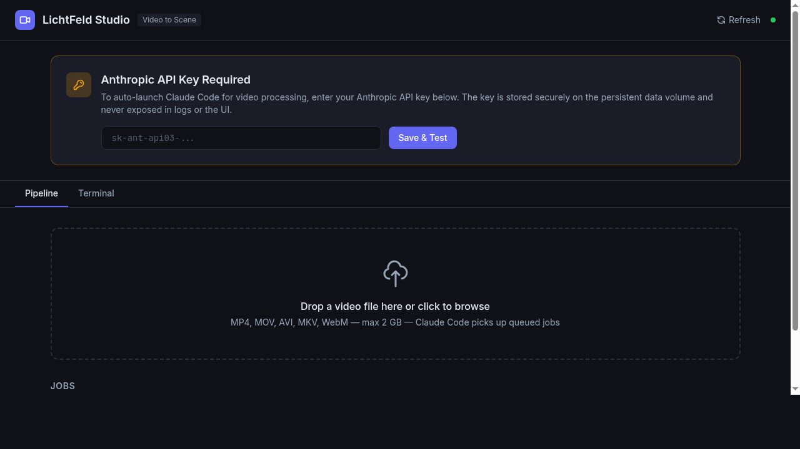 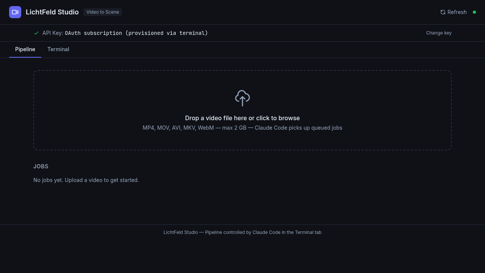
</div>

- **File browser with previews** — per-run output tree (`/api/runs/<id>/tree`) with range-served image, mesh
  and splat previews; frame listing with thumbnails.
- **Per-run zip download** — streamed, constant-memory zip of each run's assets (`/api/runs/<id>/zip`).
- **3D viewers** — a Gaussian-splat viewer (`@mkkellogg/gaussian-splats-3d` over Vitrine's `.ksplat`) and an
  object `<model-viewer>` (`/mesh-view/<id>`), both vendored offline (no CDN) for the air-gapped appliance.

## Brand & logo exploration

Two logo exploration boards were generated with the in-house nano-banana (Gemini 3 Pro Image) toolchain — v1
refined/glass/archival, v2 (ideated in dialogue with GLM-5.2) bolder/warmer/editorial. Palette anchors on
University of Salford red (`#B71234`) and a DreamLab indigo accent.

<div align="center">
 
</div>

Micro-packs + rationale: [`docs/renders/logos/`](docs/renders/logos/).

## Repository layout

```
Vitrine/
├── src/pipeline/     ← the Python pipeline (capture QA → SfM → 3DGS → mesh/splat → objects → UE)
├── src/web/          ← Flask web UI (:7860): ingest, run browser with previews, 3D viewers, per-run zip
├── scripts/          ← pipeline tooling, mesh/splat/UE drivers, bridges
├── unreal/           ← self-contained UE 5.8 overlay (engine, runtime, NanoGS plugin, Dockerfiles)
├── onboarding/       ← Rust/Axum exhibit-manifest wizard (:8088)
├── docker/           ← stack Dockerfiles + entrypoints (gaussian-toolkit / comfyui / milo / come)
├── docs/             ← architecture, workflows, capture protocol, the capture-adaptive decision tree
├── report/           ← the LaTeX technical report + compact institutional reports
├── research/         ← ADRs + work orders (SOTA-selection traceability)
└── vendor/
    └── lichtfeld-studio/   ← vendored 3DGS tool (submodule @ v0.5.3)
```

## Status

**E2E validated on real raw capture (`rawcapdev`, 2026-07-02).** One 55-frame phone capture produced a
4M-Gaussian room splat **and** a textured, staged object game-asset (see [Results](#results--the-rawcapdev-end-to-end-run)).

- **Ingest + SfM** — operational; camera white-balance on decode; COLMAP undistortion capped at
  `max_image_size=2000` so training images are sized correctly and the GPU is not starved by per-load CPU
  downscaling. COLMAP registered 100 % of frames.
- **3DGS training** — LichtFeld `igs+` runs GPU-bound (~15 min, 30k iters) with the v0.5.3 binary baked into
  the image.
- **Object meshing** — the hero object was reconstructed end-to-end via **TRELLIS.2 image→3D** to a
  4096 PBR-textured GLB (274k verts), positioned by camera-axis convergence, staged in a Blender exhibit
  scene with `v2g:*` metadata, and wired into the web `<model-viewer>`. A drtk torch-ABI mismatch that blocked
  all PBR texturing is fixed and self-healing in the ComfyUI build.
- **Known follow-up** — SAM3 concept segmentation currently returns coarse bounding boxes rather than
  per-object silhouettes; silhouette-quality masks are the remaining lever for *precise* automated per-object
  isolation and in-room placement. The working object path in the interim is a SAM/box crop fed to TRELLIS.2.
- **Web control surface** — loopback-only (`127.0.0.1:7860`); file browser, per-run zip, splat + mesh viewers.
- **Capture quality is the dominant bottleneck** — see the [capture protocol](docs/capture-protocol.md) and
  `docs/capture-methodology.md`.

Live status: [`docs/engineering-log.md`](docs/engineering-log.md).

## Documentation

- **[Capture protocol](docs/capture-protocol.md)** — how to shoot for reconstruction (DSLR/mirrorless + phone) and log in / onboard.
- **Technical report** — [`report/v5/`](report/v5/) (LaTeX → PDF).
- **Institutional reports** — mono-Docker security & business case, and the capture/onboarding guide (`report/`).
- **Architecture & ADRs** — [`docs/`](docs/) and [`research/decisions/`](research/decisions/).

## Build & run

Prerequisites and the full build are in [`docs/build/`](docs/build/). Common entry points:

```bash
git clone --recurse-submodules <this-repo>                  # pulls the vendored LichtFeld tool
docker compose -f docker-compose.consolidated.yml up -d     # bring up the stack (VITRINE_CLAUDE_ENABLED=0 by default — see below)
ssh -N -L 7860:localhost:7860 <user>@<rig>                  # then open http://localhost:7860 (ADR-022/ADR-024: loopback-only)
scripts/run_comfyui.sh                                       # owner ComfyUI (TRELLIS.2 / Hunyuan3D / SAM3D)
python -m pipeline.sota_registry check                       # SOTA preflight (weights/VRAM/pins)
```

By default `VITRINE_CLAUDE_ENABLED=0`: no in-container Claude terminal, no auto-launched Claude Code. Set
`VITRINE_CLAUDE_ENABLED=1` (e.g. `VITRINE_CLAUDE_ENABLED=1 docker compose -f docker-compose.consolidated.yml up -d`)
to opt into the internal Claude intelligence (ADR-024).

## License

GPL-3.0 (derivative work of LichtFeld Studio, GPL-3.0). Model weights carry their own licenses; Vitrine is a
non-commercial research project and selects models accordingly.
