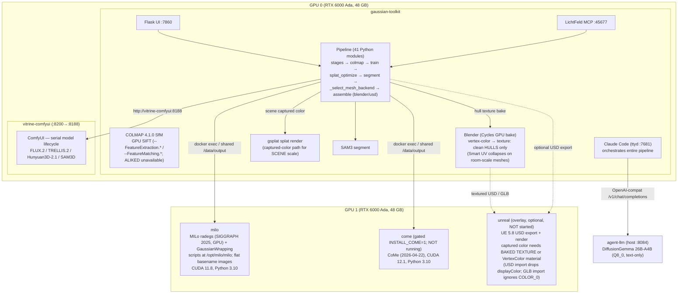

# Architecture

## Container Deployment

Vitrine runs as a small set of Docker containers sharing volumes for output data, defined by the root `docker-compose.consolidated.yml` (+ `Dockerfile.consolidated`) with sidecar images built from `docker/Dockerfile.milo`, `docker/Dockerfile.come`, and `docker/Dockerfile.gw`. An optional UE 5.8 overlay (`unreal/docker-compose.unreal.yml`) adds the `unreal` and `unreal-mcp-bridge` containers.

### gaussian-toolkit (main container)

| Property | Value |
|----------|-------|
| Base image | `nvidia/cuda:12.8.1-devel-ubuntu24.04` |
| Python | 3.12 |
| GPU assignment | Device 0 (RTX 6000 Ada, 48 GB) |
| Ports | 7860 (web UI — file browser, splat viewer, per-run zip; loopback-only 127.0.0.1, SSH tunnel — ADR-022/ADR-023; `LFS_WEB_HOST` env opt-in for docker-net access), 7681 (ttyd terminal), 45677 (LichtFeld MCP), 8088 (onboarding wizard), 5901→5902 (VNC — host 5902, in-container 5901) |
| Process manager | supervisord |
| Memory limit | 200 GB |
| Shared memory | 64 GB |

Runs: COLMAP SfM, LichtFeld Studio 3DGS training (ImprovedGS+ densification), SAM3 segmentation, Blender scene assembly, Flask web UI, LichtFeld MCP, Claude Code (agentic orchestrator), splat-transform (Node.js, post-training splat optimisation). The owner ComfyUI (FLUX.2 / TRELLIS.2 / Hunyuan3D-2.1 / SAM3D) runs as a separate `vitrine-comfyui` container reusing the same image (see below), reached over `v2g-net` as `http://vitrine-comfyui:8188` (host port 8200).

### vitrine-comfyui (owner ComfyUI container)

| Property | Value |
|----------|-------|
| Base image | `gaussian-toolkit:latest` (reuses the main image) |
| GPU assignment | Device 0 (RTX 6000 Ada, 48 GB) — shares GPU 0 with `gaussian-toolkit`, serialised |
| Ports | 8200 (host) → 8188 (in-container ComfyUI) |
| Launched by | `scripts/run_comfyui.sh` → `scripts/comfyui_entrypoint.sh` |
| Models | FLUX.2-dev, TRELLIS.2-4B, Hunyuan3D-2.1, SAM3D — all from the unified `data/comfyui/models/` tree |

Owner ComfyUI for the SOTA generative stack. Because FLUX.2 (~44.6 GB) and TRELLIS.2 (~24 GB) cannot co-reside on a 48 GB card, models load/unload **serially** via ComfyUI `POST /free` (ADR-013); peak VRAM is `max(stage)`, not the sum. The pipeline reaches it by service name on `v2g-net` (`http://vitrine-comfyui:8188`).

### milo (sidecar container)

| Property | Value |
|----------|-------|
| Base image | `nvidia/cuda:11.8.0-devel-ubuntu22.04` (`gaussian-toolkit-milo:latest`) |
| Python | 3.10 |
| GPU assignment | Device 1 (RTX 6000 Ada, 48 GB) |
| Entrypoint | `sleep infinity` (called via `docker exec`) |
| Tools | MILo (SIGGRAPH Asia 2025) + optional GaussianWrapping (build-arg gated) |
| CUDA extensions | diff-gaussian-rasterization (3 variants), simple-knn, fused-ssim, nvdiffrast, tetra-triangulation |

MILo requires CUDA 11.8 + GCC <= 11 for its CUDA extension compilation, incompatible with the main container (CUDA 12.8 + GCC 14). GaussianWrapping shares this environment exactly (CUDA 11.8, Python 3.10) and is installed at `/opt/gaussianwrapping` when enabled via `--build-arg INSTALL_GAUSSIANWRAPPING=1` (ADR-005; licence pending).

The main container invokes MILo and GaussianWrapping via:
```bash
docker exec milo python3 /opt/milo/milo/train.py --source_path /data/output/JOB/colmap ...   # MILO_DIR=/opt/milo/milo
docker exec milo python3 /opt/gaussianwrapping/train.py -s /data/output/JOB/colmap ...
```

> **MILo invocation gotchas (2026-06-21):** the MILo scripts live at `/opt/milo/milo/` (set `MILO_DIR` accordingly — it is *not* the container working dir). MILo references images by **basename**, so `undistorted/images/` must be **flat** — flatten any `obj/` or wide-angle subfolders the COLMAP undistorter creates, or MILo `FileNotFound`s. MILo extracts via radegs (GPU); prefer it over the numpy TSDF fallback (L8).

### come (sidecar container)

| Property | Value |
|----------|-------|
| Base image | `nvidia/cuda:12.1.1-devel-ubuntu22.04` (`gaussian-toolkit-come:latest`) |
| Python | 3.10 |
| GPU assignment | Device 1 |
| Entrypoint | `sleep infinity` (called via `docker exec`) |
| Tools | CoMe (confidence-based marching tetrahedra; code released 2026-04-22) |
| Build gate | `--build-arg INSTALL_COME=1` (off by default; licence pending — ADR-004) |

CoMe requires Python 3.10 and CUDA 12.1, incompatible with both the main container (CUDA 12.8, Python 3.12) and the MILo sidecar (CUDA 11.8). It therefore occupies a dedicated sidecar. The sidecar definition in `docker-compose.consolidated.yml` is present, but there is no prebuilt image and CoMe is only installed when `INSTALL_COME=1` is passed at build time, so the container is **not running** by default (licensing-gated, default-off env-mesh sidecar).

The main container invokes CoMe via:
```bash
docker exec come python3 /opt/come/train.py --splatting_config configs/come_unbounded.json -s /data/... -m /data/...
docker exec come python3 /opt/come/extract_mesh_tets.py -m /data/...
```

### Shared Resources

```
Volumes:
  ./output:/data/output         # All containers read/write pipeline outputs
  hf-cache:/opt/hf-cache        # HuggingFace model cache (shared)
  models-data:/opt/models        # Persistent model storage
  claude-session:/home/ubuntu/.claude  # Claude Code OAuth (main only)
```

## System Diagram



Networks: `gaussian-toolkit`, `vitrine-comfyui`, and `milo` share the internal `v2g-net` bus (resolve each other by name). `gaussian-toolkit` (aliases `gaussian-toolkit`, `vitrine`), `vitrine-comfyui`, `milo`, and the host `agentbox` (Claude Code env) also join the shared external `visionclaw_network`, so VisionFlow (host `:4000`) and the agent environment reach the pipeline by service name.

## Mesh Extraction Multi-Backend Strategy

The MeshExtraction bounded context (see `research/ddd/bounded-contexts.md`, section 2.5) spans all four containers. Backend selection is a domain policy evaluated in `stages._select_mesh_backend()` at runtime.

| Backend | Module | Container | CUDA | Speed | Thin Structures |
|---------|--------|-----------|------|-------|-----------------|
| TSDF | `mesh_extractor.py` | main | 12.8 | ~5 min | Poor |
| MILo | `milo_extractor.py` | milo sidecar | 11.8 | ~69 min | Moderate |
| CoMe | `come_extractor.py` | come sidecar | 12.1 | ~25 min | Moderate |
| GaussianWrapping | `gaussianwrapping_extractor.py` | milo sidecar | 11.8 | ~30-50 min | Excellent |

> **GPU-always policy (L8, 2026-06-21):** prefer MILo (radegs, GPU) over the numpy TSDF
> fallback — TSDF remains only for preview/speed. Likewise GPU SIFT, Cycles GPU bake, and
> GPU video decode are the supported paths; any CPU path (e.g. a Python PIL texture loop) is
> a defect to replace. **Captured-color caveat (L2):** the Blender Cycles vertex-color →
> texture bake (`blender_assembler.bake_vertex_colors_to_texture`) only works on clean,
> watertight **hulls** — Smart UV Project collapses on room-scale MILo meshes (many thin /
> disconnected components produce degenerate UV islands → a near-black atlas). For
> **scene-scale captured color**, the highest-fidelity output is a direct gsplat splat
> render, not a baked mesh texture.

Each backend exposes the same three public symbols: `XConfig` dataclass, `is_X_available() -> bool`, and `run_X(colmap_dir, output_dir, config) -> dict`. The `is_X_available()` guard queries the relevant container before committing to a selection, preventing hangs on unavailable sidecars (ADR-003).

**Auto-selection order** when `mesh_method = "auto"`:
1. Preview mode or speed priority → TSDF
2. Thin-structure scene hint and GaussianWrapping available → GaussianWrapping
3. CoMe sidecar available → CoMe (3x faster than MILo at comparable F1)
4. MILo sidecar available → MILo
5. Fallback → TSDF

## Bounded Context Summary

The pipeline is modelled as seven bounded contexts (see `research/ddd/bounded-contexts.md`):

| Context | Key Modules | Produces |
|---------|-------------|----------|
| Ingestion | `frame_selector.py`, `fibonacci_sampler.py` | `FrameSet` |
| Reconstruction | `colmap_parser.py`, `coordinate_transform.py` | `ColmapDataset` |
| Training | `gsplat_trainer.py`, `mcp_client.py` | `GaussianModel` (PLY) |
| Segmentation | `sam2_segmentor.py`, `sam3_segmentor.py`, `mask_projector.py` | `ObjectMask` arrays |
| MeshExtraction | `mesh_extractor.py`, `milo_extractor.py`, `come_extractor.py`, `gaussianwrapping_extractor.py` | `MeshAsset` (GLB) |
| SceneAssembly | `blender_assembler.py`, `usd_assembler.py` | `UsdScene` |
| Delivery | `splat_optimizer.py`, `src/web/` (Flask blueprints: `scenes_api`, `files_api`, `zip_api`, `splat_api`) | `.ksplat` + file browser (`/api/runs/<id>/tree\|file`) + 3D splat viewer (`/api/scenes/<id>/splat/<filename>` via bundled `@mkkellogg/gaussian-splats-3d`) + per-run streamed zip (`/api/runs/<id>/zip`, `zipstream-ng`) + system stats (`/api/system/stats`) |

Orchestration (`stages.py`, `orchestrator.py`) is a published language that crosses all contexts via `StageResult`.

SceneAssembly writes native USD with `v2g:*` lineage metadata (implemented): `src/pipeline/usd_assembler.py` emits per-object `v2g:*` (`hull_glb`, `hull_backend`, `hull_vertices`/`hull_faces`, `view_synth`(+`views`), `confidence`, `gaussian_ply`, `source_job`) plus scene-level `v2g:*` (mirrored to `lichtfeld:*` for compatibility), and `scripts/generate_exhibit_usd.py` emits `scene.usda` from an e2e run.

## Claude Code as Orchestrator

Claude Code runs inside the main container (accessible via ttyd on port 7681). It drives the pipeline by:

> **Web endpoint security (ADR-022):** all Flask endpoints on port 7860 bind `127.0.0.1` (loopback-only) by default and are reached externally only via an SSH tunnel (`ssh -N -L 7860:localhost:7860`). Docker-net access (for container-to-container calls on `v2g-net` / `visionclaw_network`) requires explicitly setting `LFS_WEB_HOST=0.0.0.0` in the container environment — this must never be the default in the image or compose file. The single-mega-image security boundary (ADR-022/ADR-023) is not weakened by any of the new ArchiveSpace web endpoints.

1. Receiving a job from the Flask web UI
2. Calling pipeline stages in sequence via Python imports
3. Invoking LichtFeld MCP tools for 3DGS training control (70+ tools on :45677)
4. Running Blender headless for scene assembly and Cycles GPU texture baking (bake targets clean watertight hulls; scene-scale captured color is served by a direct gsplat splat render instead)
5. Optionally calling the MILo sidecar for high-quality mesh extraction
6. Writing results back to `/data/output/JOB_ID/`

The pipeline modules (`src/pipeline/stages.py`) are designed as independent, stateless functions. Claude Code decides what to run next based on each stage's output. There is no hidden state machine.

## Data Flow

```
/data/output/JOB_ID/
├── input.mp4                    # Uploaded video
├── frames/                      # Extracted JPEG frames
├── colmap/                      # COLMAP sparse model + undistorted images
│   ├── images/
│   └── sparse/0/
├── training/                    # 3DGS training output
│   └── point_cloud.ply
├── segmentation/                # SAM3 per-object masks
├── objects/
│   ├── gaussians/               # Per-object PLY splats
│   └── meshes/                  # Per-object GLB meshes (TSDF or MILo)
├── blender/                     # Blender scene + baked textures
├── usd/                         # USD scene hierarchy
├── previews/                    # Blender-rendered preview images
└── download/                    # ZIP bundle for web download
```

## Key Dependencies

| Component | Version | Purpose |
|-----------|---------|---------|
| LichtFeld Studio | v0.5.2 (synced 2026-05-26) | 3DGS training + ImprovedGS+ densification, MCP server (70+ tools), native USD I/O |
| COLMAP | 4.1.0 | Structure-from-Motion — option namespace is `--FeatureExtraction.*` / `--FeatureMatching.*` (not `--SiftExtraction.*`). `FeatureExtraction.type SIFT` on GPU = 100% reg; the ALIKED enum is invalid in this build and `ALIKED_LIGHTGLUE` needs the missing `libcudnn.so.9`. Use `--ImageReader.single_camera_per_folder` for mixed cameras; mkdir the colmap dir before `feature_extractor`. |
| Open3D | 0.18+ | TSDF fusion, mesh processing |
| MILo | latest (SIGGRAPH Asia 2025) | High-quality mesh extraction via radegs/GPU (milo sidecar; scripts at `/opt/milo/milo`, `MILO_DIR`; needs flat basename images in `undistorted/images/`) |
| CoMe | initial release 2026-04-22 | Confidence-based mesh extraction (come sidecar; dev/opt-in) |
| GaussianWrapping | latest (pushed 2026-05-19) | Thin-structure mesh extraction (milo sidecar; dev/opt-in) |
| splat-transform | `@playcanvas/splat-transform` (npm) | Splat compression + format conversion |
| SAM3 | latest | Concept segmentation (4M concepts) |
| Blender | 5.0.1 | Scene assembly, Cycles GPU texture bake (vertex-color → texture; clean watertight **hulls** only — Smart UV Project collapses on room-scale meshes, so scene captured color uses a direct gsplat splat render) |
| Flask | 3.x | Web interface |
| PyAV | latest | Video frame extraction |
| gsplat | latest | Depth rendering for TSDF |
| OpenUSD | 25.02+ | USD scene export |
| Node.js | system | splat-transform (npm/npx) runtime |
| NumPy | pipeline dep | Fibonacci-sphere scoring, mask projection |

---

## v3 End-to-End Architecture (largely implemented)

> Most of this section is now **built and verified**: the `exhibit.toml` manifest loader,
> `sota_registry`, the serial model lifecycle, the service-DNS (`v2g-net`) endpoints,
> agent-controlled ComfyUI, the DiffusionGemma agent LLM, native USD export, and `v2g:*`
> metadata are all shipped. Genuinely-future items are flagged inline where they remain
> design-only. Governed by ADR-012 through ADR-016 in `research/decisions/`.

### Single-manifest input: `exhibit.toml`

The pipeline's one human-authored input is a TOML manifest. It carries:

- `[exhibit]` — project-level identity (id, name, venue, date, curator, description) that flows into USD metadata.
- `[[objects]]` — the list of objects the agent will decompose and recover; each has a stable `id`, a `sam3_concept` string, and a `priority` (`key` | `standard`). Key-priority objects trigger the full hull-reconstruction + FLUX.2 recovery path.
- `[drive]` — Google Drive source folder URL, rclone remote name, and a `writeback = true` flag so finished artifacts are uploaded back to the same Drive folder.
- `[secrets]` — `env:NAME` references only. Credentials are never inlined, never written to the JSON run snapshot.
- `[pipeline]` — optional overrides onto `PipelineConfig` SOTA defaults (mesh backend, matcher, etc.).
- `[oversight]` — selects the pipeline overseer (see below).
- `[models]` — hardware-selected model/quant choices written by Vitrine Onboarding.

The `manifest.py` loader parses this, resolves `env:` references, and materialises the existing `PipelineConfig` as the runtime artifact. The manifest is the source; the JSON snapshot is the run record. ADR-013. (Implemented.)

### Orchestrator and tool: Claude Code + DiffusionGemma

The in-container **Claude Code** agent (accessible via ttyd on port 7681) remains the pipeline overseer. It drives the stateless `stages.py` functions, calls LichtFeld MCP tools, and works around failures end-to-end. There is no hidden state machine.

**DiffusionGemma 26B-A4B** (a Gemma-4 MoE, ~4B active params, Q8_0) is the local text reasoner/overseer tool the orchestrator calls — not a second orchestrator (superseding the never-wired gemma-4 `agent-vlm`, 2026-06-08). It is served on the GPU **host** (not a `v2g-net` container) by the llama.cpp `llama-diffusion-gemma-visual-server` behind a thin stdio→HTTP wrapper (`llm-server/diffusiongemma-lan-server.py`), OpenAI-compatible at **port 8084** (model id `diffusiongemma-26B-A4B-it-Q8_0`; health `GET /health`, chat `POST /v1/chat/completions`). The pipeline client is `src/pipeline/agent_llm.py` (`AgentLLM`, default `http://localhost:8084`, in-container override `V2G_AGENT_LLM_URL=http://host.docker.internal:8084`). This GGUF build is **text-only**: it reasons over captions, COLMAP stats, and gate numbers (FR-28) — not pixels. Answer length is set by `n_blocks` (256 tokens/block), it is deterministic given `seed` (temperature/top_p ignored), has a 12288-token context, and is single-context, so requests are serialised. Because DiffusionGemma cannot see, *visual* per-frame artifact triage (FR-27) now defaults to the `claude_code` backend; a vision-capable model (gemma-4 vision GGUF + mmproj, staged) remains the registry **fallback** for when visual triage is actually needed.

The `[oversight].backend` field in the manifest selects the overseer:

- `claude_code` **(default)** — the in-container Claude Code agent, no local GPU cost; requires the user to log in to Claude Code inside the container once (session persists in the `claude-session` volume).
- `diffusiongemma` — the local DiffusionGemma model also acts as text overseer; fully on-host, no API key, but creates GPU-contention with heavy generative stages.

The `[oversight].artifact_vlm` field (independent of `backend`) selects what performs bulk per-frame triage: `claude_code` (default; DiffusionGemma is text-only and cannot do visual triage) or the staged gemma-4 vision fallback (transient, loaded for the artifact stage then unloaded).

ADR-013, sections D-013.5 and D-013.6.

### Serial model lifecycle and VRAM bounding

A `ModelLifecycleManager` wraps each pipeline stage as a context manager (implemented, ADR-013). Each stage declares a `ModelSpec` with a VRAM estimate and an unload tier:

- **Soft unload** (default) — in-process free via ComfyUI `POST /free`, llama.cpp/vLLM model unload, `torch.cuda.empty_cache()`. Fast, container stays warm.
- **Hard unload** — `docker stop` / `docker start` on the service container. Full driver-level VRAM reclamation; used selectively for back-to-back heavy stages (FLUX.2 → TRELLIS.2 / Hunyuan3D) where soft-free leaves fragmentation.

Peak VRAM = `max(stage VRAM)`, not `sum(stages)`. Because FLUX.2-dev (~44.6 GB) and TRELLIS.2 (~24 GB) cannot co-reside on a single 48 GB card, serial load/unload is the only way the full SOTA model set fits a single-host budget; a single 48 GB GPU is the practical floor (TSDF-only mesh runs on 12 GB). ADR-013, section D-013.2.

| Stage | Model | Engine | ~VRAM | Unload tier |
|-------|-------|--------|-------|-------------|
| Text reasoning / overseer (FR-28) | DiffusionGemma 26B-A4B | host `agent-llm:8084` (OpenAI-compat) | ~27 GB (Q8_0) | host service |
| SfM matching | ALIKED + LightGlue | in-proc torch | < 4 GB | soft |
| 3DGS training | LichtFeld / gsplat | native | scales with scene | n/a |
| Decomposition | SAM3 | in-proc torch | ~8 GB | soft |
| Inpaint / occluded-face recovery | FLUX.2-dev fp8mixed | `vitrine-comfyui:8188` | ~44.6 GB | **hard** |
| Hull reconstruction (primary) | TRELLIS.2-4B | `vitrine-comfyui:8188` | ~24 GB | **hard** |
| Hull reconstruction (fallback) | Hunyuan3D-2.1 | `vitrine-comfyui:8188` | ~29 GB | **hard** |
| Mesh extraction | CoMe (default, gated) / MILo / TSDF | sidecar | sidecar GPU | n/a |

### `v2g-net` Docker mesh

The old hardcoded `localhost:port` endpoints are replaced by user-defined Docker bridge networks. Services resolve by DNS name (implemented, ADR-013, FR-31/33):

```
v2g-net (internal bridge)
├── vitrine-comfyui :8188  FLUX.2-dev (fp8mixed) + TRELLIS.2-4B + Hunyuan3D-2.1 + SAM3D
│                  :3001   Salad add-on control-plane API (model probe / lifecycle)
├── gaussian-toolkit       orchestrator (addresses peers as http://vitrine-comfyui:8188 etc.)
└── milo  (sidecar)        device_ids ['1'] — docker exec
    come  (sidecar)        device_ids ['1'] — docker exec (gated, non-commercial; not running)

visionclaw_network (shared external bridge)
├── gaussian-toolkit (aliases gaussian-toolkit, vitrine)
├── vitrine-comfyui
├── milo
└── agentbox (host Claude Code env) — reaches the pipeline by service name on its ports

(external host service, not a v2g-net container)
agent-llm  host :8084   DiffusionGemma 26B-A4B (Q8_0, text-only) — OpenAI-compatible reasoner/overseer
                        reached as http://host.docker.internal:8084 from containers
```

The `ModelLifecycleManager` hard-tier uses `docker stop` / `docker start` on `vitrine-comfyui` on `v2g-net` to guarantee VRAM reclamation; DiffusionGemma is an external host endpoint (not a container the manager starts/stops). ADR-013, section D-013.3.

### Agent-controlled ComfyUI recovery

The owner `vitrine-comfyui` is pinned to a known-good state via the **Salad add-on control API** (`vitrine-comfyui:3001`) — an in-container control plane for model probe, download, and lifecycle, not a cloud service. The `RecoveryController` (a stateless helper the orchestrator invokes) runs a per-object loop:

1. **Plan** — compose the FLUX.2-dev view-completion or TRELLIS.2 / Hunyuan3D-2.1 hull graph from a template, parameterised by object identity and the artifact report.
2. **Submit** — `POST /prompt` (graph API); poll `/history/{id}`; fetch outputs.
3. **Evaluate** — scores the generated image or mesh render against object identity and artifact criteria. This step is *visual*, so it needs the staged gemma-4 vision fallback (or the `claude_code` backend) — text-only DiffusionGemma cannot see and handles only the planning/reasoning around it.
4. **Decide** — `accept` | `re-prompt` (adjust denoise/guidance/seed/mask, bounded retry budget) | `veto` (unrecoverable). Every attempt is annotated in the per-video ledger; nothing is silently dropped.
5. **Release** — Salad control free/unload the stage model before the next stage.

ADR-014. See also [v3 Pipeline Design](architecture/v3-pipeline.md) for the full `v2g-net` diagram.

### SOTA tooling defaults (ADR-012)

| Axis | Legacy default | Current SOTA default |
|------|-----------|----------------------|
| Mesh backend | TSDF | **CoMe** (gated) with **MILo** / GaussianWrapping / TSDF fallbacks |
| SfM matching | SIFT exhaustive | **ALIKED + LightGlue** (SIFT fallback) |
| Hull reconstruction | Hunyuan3D-2.1 | **TRELLIS.2-4B** (MIT), with **Hunyuan3D-2.1** fallback |
| Inpaint / view recovery | FLUX.1-Fill-dev | **FLUX.2-dev** (fp8mixed); Qwen-Image-Edit commercial-safe alt |

Fallbacks remain available (TSDF, SIFT, Hunyuan3D-2.1, FLUX.1-Fill) behind capability probes so a missing checkpoint degrades gracefully rather than halting. The `sota_registry` validates staged weights / VRAM / pins / licence before any run. ADR-012.

### Optional Unreal Engine 5.8 overlay (ADR-016)

A self-contained UE 5.8 overlay lives at the top-level `unreal/` directory: `unreal/engine/` (the UE 5.8 Linux installed build, ~73 GB, gitignored, bind-mounted read-only at `UE_ROOT=/opt/ue`), `unreal/runtime/` (`Vitrine.uproject`, `entrypoint.sh`, `import_and_render.py`, `import_usd_stage.py`, `mcp_bridge.py`), `unreal/Dockerfile.unreal`, and `unreal/docker-compose.unreal.yml`.

The image (`vitrine-unreal:5.8`, ~6.15 GB, **built**) builds **from an NVIDIA CUDA base** (`nvidia/cuda:12.8.1-runtime-ubuntu22.04`) plus UE Linux runtime prereqs — it no longer needs Epic GitHub-org access or a `ghcr.io/epicgames` pull. Status: image built and the MCP bridge tested on the shared docker network; the overlay is **not started yet** (editor smoke-test pending). It is an optional downstream overlay — the pipeline does not wait on it; its USD output is the contract.

- GPU 1. Ports: 30010 Web Remote Control (unicast, **primary** control path, container-friendly), 8000 first-party UE MCP (experimental HTTP+SSE, secondary), 9100 `unreal/runtime/mcp_bridge.py` via the `unreal-mcp-bridge` container.
- Rendering: Lumen via `-RenderOffscreen` (Linux/Vulkan); `-nullrhi` for GPU-less import/assemble. Path Tracer is Windows/DX12-only and out of scope.
- USD is imported as a live `UsdStageActor` (not baked — the baked importer drops `customData`); `v2g:*` lineage is mirrored to UE tags via `pxr`.
- **Captured color into UE (L2, 2026-06-21):** the live `UsdStageActor` import **drops the `displayColor` primvar** (the scene renders flat white) and the Interchange **GLB import ignores vertex colors / `COLOR_0`** ("primitives with no materials assigned"). To carry captured color you must bind either (a) a **baked-texture** material (`UsdUVTexture` / textured GLB) or (b) an explicit **VertexColor** material — raw per-vertex color alone is not honoured. The proven bake works on clean hulls; for the room/scene the highest-fidelity visual is a direct gsplat splat render.
- Bring up:

```bash
docker compose -f docker-compose.consolidated.yml -f unreal/docker-compose.unreal.yml up -d unreal unreal-mcp-bridge
```
