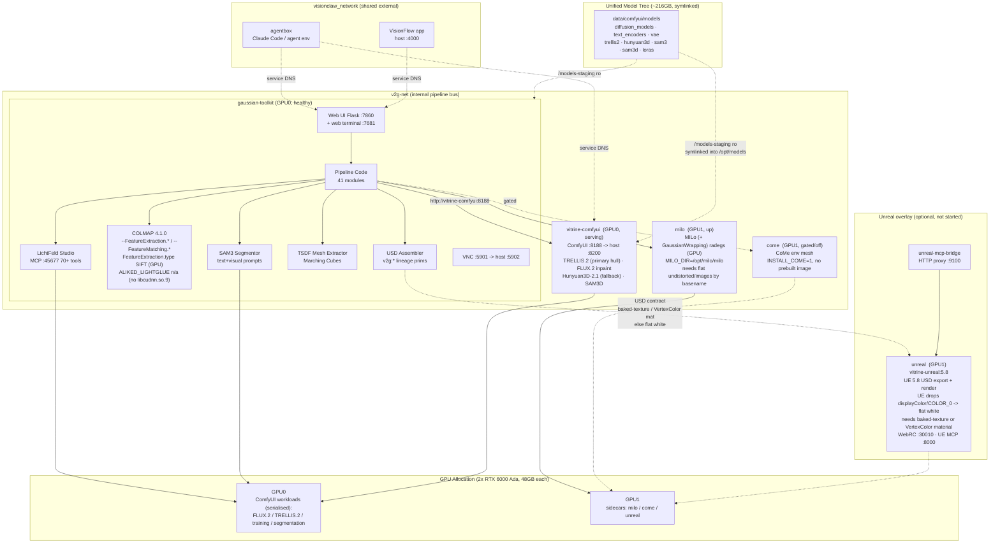

# Cluster Setup

## Consolidated Docker Architecture

The pipeline runs as a multi-container stack on a dedicated workstation with dual RTX 6000 Ada GPUs. The two ComfyUI workloads (`gaussian-toolkit` + `vitrine-comfyui`) share GPU 0; the mesh/Unreal sidecars (`milo`, `come`, `unreal`) run on GPU 1. Containers reach each other by service name over two Docker networks (`v2g-net` internal, `visionclaw_network` shared), so current-state access uses service DNS / localhost rather than a hardcoded host IP.

### Operator access

Port 7860 is loopback-only (`127.0.0.1`). Reach it from your workstation via an SSH LocalForward tunnel — never expose it on `0.0.0.0` (ADR-022):

```bash
ssh -N -L 7860:localhost:7860 <user>@<rig>
```

Then open `http://localhost:7860` in your browser. The tunnel can be left running in the background; kill it with `Ctrl-C` when done.

### Host Machine

| Component | Specification |
|-----------|--------------|
| CPU | AMD Threadripper PRO 48-core |
| RAM | 251 GB |
| GPU 0 | NVIDIA RTX 6000 Ada (48 GB VRAM) |
| GPU 1 | NVIDIA RTX 6000 Ada (48 GB VRAM) |
| Total VRAM | 96 GB |
| OS | Linux |

### Exposed Ports

| Host Port | Container Port | Service | Purpose |
|-----------|----------------|---------|---------|
| 7860 | 7860 | Web UI (Flask) | Ingest (raw-stills drag-drop, zip bundle, Drive URL), run browser with file tree + thumbnail previews, per-run streamed zip download, embedded 3D splat viewer (.ksplat/.ply), job management. Loopback-only (127.0.0.1); access via SSH LocalForward per ADR-022. |
| 7681 | 7681 | Web terminal (ttyd) | Orchestrator shell |
| 8200 | 8188 | ComfyUI (`vitrine-comfyui`) | TRELLIS.2 / Hunyuan3D-2.1 / SAM3D nodes, FLUX.2 inpainting |
| 45677 | 45677 | LichtFeld MCP | 70+ JSON-RPC tools for agent control |
| 5902 | 5901 | VNC | Remote desktop (host 5902 — agentbox owns host 5901) |
| 8088 | 8088 | Onboarding wizard (Rust/Axum) | `exhibit.toml` manifest builder |

#### Optional Unreal overlay ports

Brought up only when the UE 5.8 export overlay is started:

| Host Port | Service | Purpose |
|-----------|---------|---------|
| 30010 | UE Web Remote Control | PRIMARY control path (unicast, container-friendly) |
| 8000 | First-party UE MCP | Experimental HTTP+SSE control (secondary) |
| 9100 | `unreal-mcp-bridge` | HTTP proxy wrapping the UE control surfaces |

## Infrastructure Diagram



## VRAM Management Strategy

**GPU 0** runs all ComfyUI workloads (`gaussian-toolkit` + `vitrine-comfyui`: FLUX.2, TRELLIS.2, training, segmentation), serialised. **GPU 1** runs the mesh / Unreal sidecars (`milo`, `come`, `unreal`).

The big SOTA models do **not** co-reside: FLUX.2 (~44.6 GB) and TRELLIS.2 (~24 GB) together exceed a single 48 GB card, so ComfyUI loads and unloads them **serially** via `POST /free` between stages. Consequently **peak VRAM = max(stage), not the sum** — a single 48 GB GPU is the practical floor for the full SOTA stack, while a TSDF-only mesh run fits in 12 GB (ADR-013).

| Pipeline Stage | GPU 0 (ComfyUI workloads) | GPU 1 (sidecars) |
|---------------|---------------------------|------------------|
| COLMAP SfM | ~1.5 GB (SIFT) | idle |
| 3DGS Training | 8.4 GB (CUDA kernels) | idle |
| SAM3 Segmentation | 9.5 GB (transformer) | idle |
| Mask Projection | CPU only | idle |
| FLUX.2 view completion | ~44.6 GB (loaded, then `/free`) | idle |
| TRELLIS.2 hull (primary) | ~24 GB (loaded after FLUX.2 unloads) | idle |
| Hunyuan3D-2.1 hull (fallback) | ~29 GB | idle |
| MILo / CoMe env mesh | idle | sidecar VRAM |
| TSDF Mesh Extraction | CPU + 3 GB RAM | idle |
| USD Assembly | CPU only | idle |

Models are loaded/unloaded per-stage. The ~216 GB unified model tree (`data/comfyui/models`) holds all checkpoints on fast SSD so loading is under 30 seconds per model.

## Resource Usage by Pipeline Stage

| Stage | Duration | Peak VRAM | Peak RAM | GPU Util | Primary Resource |
|-------|----------|-----------|----------|----------|-----------------|
| Frame Extraction | 5s | 0 MB | 200 MB | 0% | CPU (PyAV) |
| COLMAP Feature Extraction | 30s | ~1.5 GB | 2 GB | 80% | GPU SIFT (`--FeatureExtraction.type SIFT`; ALIKED_LIGHTGLUE n/a without libcudnn.so.9) |
| COLMAP Matching | 2 min | ~1.5 GB | 4 GB | 60% | GPU + CPU (`--FeatureMatching.*` namespace, not `--SiftMatching.*`) |
| COLMAP Sparse Recon | ~20 min | ~1.5 GB | 1.1 GB | 4800% CPU | CPU (48 cores) — **defect: GPU-always directive, replace with GPU mapper** |
| COLMAP Undistortion | 10s | 0 MB | 500 MB | 0% | CPU + Disk I/O |
| 3DGS Training (7k iter) | 2m 15s | 8.4 GB | 30 GB | 99% @ 299W | GPU (CUDA kernels) |
| SAM3 Segmentation (13 frames) | 46s | 9.5 GB | 31 GB | 92% @ 246W | GPU (transformer) |
| SAM3 Segmentation (121 frames) | ~5 min | 9.5 GB | 31 GB | 92% | GPU (transformer) |
| Mask Projection to 3D | 7.3 min | 0 MB | ~4 GB | 0% | CPU (batch voting) |
| TSDF Mesh Extraction | 12 min | 0 MB | ~3 GB | 0% | CPU + RAM |
| Object Separation | variable | 0 MB | ~2 GB | 0% | CPU |
| USD Assembly | < 1 s | 0 MB | 100 MB | 0% | CPU |

> **COLMAP 4.1.0 reproducibility note (L4).** This build renamed the option
> namespace: feature extraction/matching flags are `--FeatureExtraction.*` /
> `--FeatureMatching.*` (the legacy `--SiftExtraction.use_gpu` /
> `--SiftMatching.*` forms are gone). Set `FeatureExtraction.type SIFT` — the
> `ALIKED` / `ALIKED_LIGHTGLUE` enum is invalid in this build (it needs
> `libcudnn.so.9`, which is missing), so the GPU SIFT path is the working
> configuration and gave 100% registration. Use
> `--ImageReader.single_camera_per_folder` for mixed cameras, and `mkdir` the
> colmap dir before `feature_extractor` (the `database_parent_path` check fails
> otherwise). Feature extraction, matching, and the downstream mapper should all
> stay on GPU — any CPU path (the sparse-recon mapper above) is a defect to
> replace per the GPU-always directive (L8).

> **UE 5.8 captured-color contract (L2).** UE import drops the `displayColor`
> primvar on USD ingest and ignores `COLOR_0` vertex colors on GLB Interchange
> import (the mesh renders flat white, "no materials assigned"). So the
> `USD contract` edge into `unreal` requires either a **baked-texture material**
> (UsdUVTexture / textured GLB) or an explicit **VertexColor material** — vertex
> color alone does not survive. The proven bake is
> `src/pipeline/blender_assembler.py` `bake_vertex_colors_to_texture()` (Smart UV
> Project + Cycles GPU DIFFUSE bake), but it only works on clean watertight
> **hulls**: Smart UV Project collapses on room-scale MILo meshes (many thin /
> disconnected components → degenerate near-zero-area UV islands → near-black
> atlas). For room/scene-scale captured color the highest-fidelity output is a
> **direct gaussian-splat render (gsplat)**, not a baked mesh texture.

> **MILo mesh-extraction note (L5).** MILo scripts live at `/opt/milo/milo/`
> (set `MILO_DIR` accordingly), and MILo references images by **basename**, so
> `undistorted/images/` must be **flat** — flatten any `obj/` or wide-angle
> subfolders the COLMAP undistorter creates or MILo `FileNotFound`s. Use the
> GPU `radegs` extractor, not a numpy/CPU TSDF (L8).

## Unified Model Tree

`data/comfyui/models` is ComfyUI's native model store and the **single source** for all weights (~216 GB, gitignored). There is no `/staging` copy and no duplication. The tree is bind-mounted **read-only** at `/models-staging`; `docker/entrypoint.sh` then **symlinks** (never copies) each category from `/models-staging` into `/opt/models` at container start. The old first-run 216 GB copy that filled the disk is dead — disk now holds ~97 GB free. Because `entrypoint.sh` is bind-mounted into the existing image (`./docker/entrypoint.sh:/opt/entrypoint.sh:ro`), entrypoint edits apply without an image rebuild.

```
data/comfyui/models/     (~216GB total, bind-mounted ro at /models-staging,
                          symlinked per-category into /opt/models)
├── diffusion_models/
│   └── flux2-dev.safetensors        (FLUX.2, ~44.6GB, non-commercial)
├── text_encoders/
│   └── ...
├── vae/
│   └── ...
├── trellis2/
│   └── ...                          (TRELLIS.2-4B, primary hull, MIT)
├── hunyuan3d/
│   └── ...                          (Hunyuan3D-2.1, fallback hull)
├── sam3/
│   └── ...
├── sam3d/
│   └── ...
└── loras/
    └── ...
```

## Minimum Hardware Specification

Based on measured peak usage with 20% headroom:

| Component | Minimum | Recommended | Our Setup |
|-----------|---------|-------------|-----------|
| GPU VRAM | 12 GB | 48 GB (1 GPU) | 96 GB (2x RTX 6000 Ada) |
| System RAM | 36 GB | 64 GB | 251 GB |
| CPU Cores | 8 | 32 | 48 (Threadripper PRO) |
| Disk (SSD) | 50 GB free | 300 GB free | ~216 GB models + workspace |
| GPU Compute | SM 7.5+ (Turing) | SM 8.9+ (Ada) | SM 8.9 (Ada Lovelace) |
| CUDA | 11.8+ | 12.1+ | 12.4 |

### GPU Compatibility Notes

- **12 GB VRAM**: TSDF-only mesh path. Runs if segmentation and training do not overlap; use `CUDA_VISIBLE_DEVICES` to serialize. No SOTA hull (FLUX.2 / TRELLIS.2).
- **24 GB VRAM**: Fits TRELLIS.2 (~24 GB) on its own, but not alongside FLUX.2 (~44.6 GB) — view completion must run on a larger card or a remote endpoint.
- **48 GB VRAM (1 GPU)**: Practical floor for the full SOTA stack. FLUX.2 and TRELLIS.2 are loaded/unloaded serially via ComfyUI `/free`, so peak VRAM = max(stage), not the sum.
- **96 GB VRAM (dual GPU)**: GPU 0 runs all ComfyUI workloads (FLUX.2 / TRELLIS.2 / training / segmentation, serialised); GPU 1 runs the mesh / Unreal sidecars (`milo` / `come` / `unreal`).

## Network Topology

Two Docker networks. `v2g-net` is the internal pipeline bus (`gaussian-toolkit`, `vitrine-comfyui`, `milo` resolve each other by name — the pipeline reaches ComfyUI as `http://vitrine-comfyui:8188`). `visionclaw_network` is a shared external network that also carries `agentbox` and the VisionFlow app, so they reach the pipeline by service name on its ports (verified: `curl http://gaussian-toolkit:7860/health` and `curl http://vitrine-comfyui:8188/system_stats` succeed from agentbox). Current-state access uses service DNS / localhost, not a hardcoded host IP.

```
v2g-net (internal)  +  visionclaw_network (shared external)
├── gaussian-toolkit  (GPU0, aliases: gaussian-toolkit, vitrine)
│   ├── Web UI          :7860            (video upload + job manager)
│   ├── Web terminal    :7681            (orchestrator shell)
│   ├── LichtFeld MCP   :45677           (agent control, 70+ tools)
│   ├── VNC             :5901 -> host 5902
│   ├── Onboarding      :8088            (Rust/Axum wizard)
│   └── Pipeline modules (41 Python modules), COLMAP, SAM3, USD assembler
├── vitrine-comfyui   (GPU0)
│   └── ComfyUI        :8188 -> host 8200  (TRELLIS.2 / Hunyuan3D-2.1 / SAM3D / FLUX.2)
├── milo              (GPU1)            (MILo / GaussianWrapping mesh)
├── come              (GPU1, gated/off) (CoMe env mesh, INSTALL_COME=1)
├── agentbox          (host)           (Claude Code / agent env, on visionclaw_network)
└── Unreal overlay (optional, not started)
    ├── unreal             (GPU1, vitrine-unreal:5.8)  WebRC :30010 · UE MCP :8000
    └── unreal-mcp-bridge  :9100        (HTTP proxy over UE control surfaces)
```

GPU 0: RTX 6000 Ada 48GB — all ComfyUI workloads (FLUX.2 / TRELLIS.2 / training / segmentation, serialised).
GPU 1: RTX 6000 Ada 48GB — mesh / Unreal sidecars (`milo` / `come` / `unreal`).
