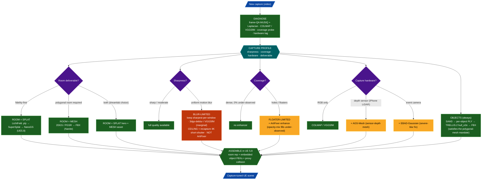
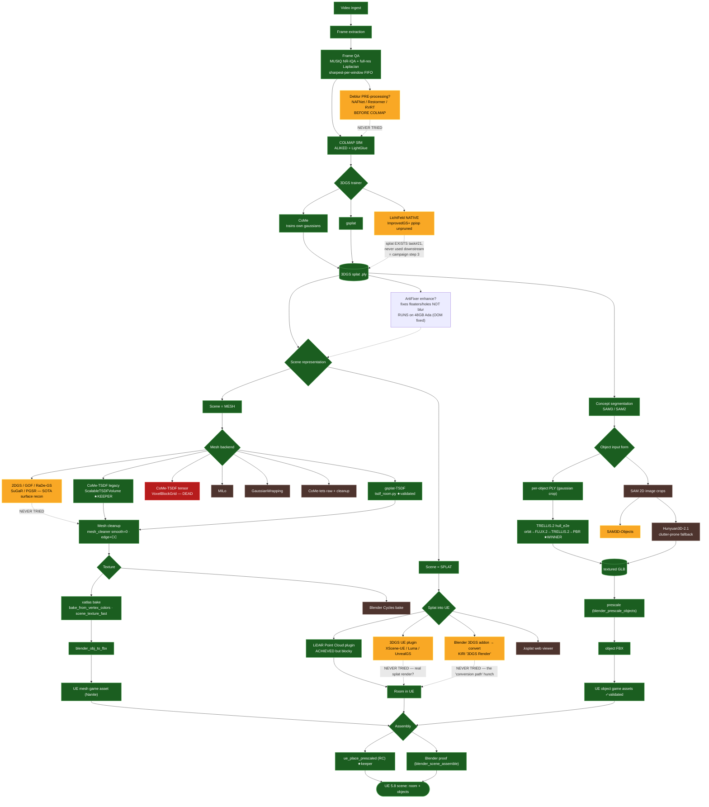

# Vitrine asset creation — capture-adaptive option tree

**Pivot (user, 2026-06-25): Vitrine is not one fixed pipeline — it is a *capture-adaptive toolkit*.**
Every capture is *diagnosed* first, and its profile (sharpness, coverage, hardware, deliverable need)
*routes* it to the configuration that fits its bottleneck. There is no single "best path" — the best
path is a function of the data. The router below selects from the component menu (further down), which
is colour-coded by how far we've pushed each option and which the 4-node research swarm validated.

## ★ The router — options depending on data

### Capture profile → recipe (the selector)

| Capture profile | Room rep | Enhancer | Mesh backend | SfM | Note |
|---|---|---|---|---|---|
| **Blurry · dense · RGB** *(dreamlab)* | splat hero **+** mesh (Opt 4) | **none** (ArtiFixer won't help) | 2DGS / PGSR | COLMAP (±VGGSfM A/B) | recapture is the real ceiling |
| Sharp · holey · RGB | splat (Opt 1/2) | **ArtiFixer** (fills holes) | 2DGS / PGSR if mesh | COLMAP | ArtiFixer's sweet spot |
| Sharp · dense · RGB | splat (Opt 1) | none | 2DGS if mesh needed | COLMAP | best case, least pain |
| iPhone **LiDAR depth** | mesh (Opt 3) | optional | **AGS-Mesh** (sensor depth) | ARKit + COLMAP | depth unlocks clean walls |
| **Event camera** · blurry | splat | — | — | event-SfM | EBAD-Gaussian deblurs |

### Worked example — the dreamlab capture
Profile: **uniform motion blur (MUSIQ ~31) · dense (0% under-observed) · RGB-only · deliverable = both.**
Router output: **Opt 4** (LichtFeld-splat→NanoGS hero **+** 2DGS/PGSR mesh asset) + frame-QA sharpest-per-window + **recapture flag** as the ceiling, **objects via TRELLIS.2**, and **NO ArtiFixer** (dense + blurry = wrong tool here, though it stays in the kit for the *sharp·holey* row above).

---

## The component menu (what the router selects from)

Legend:
- 🟢 **keeper** — validated, in active use
- 🟤 **tried** — exercised but subordinate / fallback
- 🔴 **dead** — tried and abandoned (do-not-retry)
- 🟡 **untested** — plausible path we have **never run** (the gaps this doc exists to surface)

## Track status — closed vs still-open (refreshed 2026-06-25)

Most of the original 🟡 gaps were *resolved* this session. The flowchart above is the original snapshot; **this
table is the live status.**

| # | Track | Status now | Verdict |
|---|-------|-----------|---------|
| 1 | SOTA splat→mesh (2DGS/PGSR/GOF/…) | ✅ **2DGS tested** | NOT fairer than TSDF on dreamlab — RANSAC planarity 69.7% vs CoMe 72% (11cm band), both fail. **Capture-limited, not extractor-limited.** PGSR/GOF would likely match → deprioritised. Keep for *sharp* captures. |
| 2 | Real 3DGS-in-UE plugin | ✅ **NanoGS validated** | Recompiled for UE 5.8; renders real Gaussians; the **full scene (pruned splat room + chair/vacuum/toolbox FBXs) stands in the editor** (`docs/renders/dreamlab/`). Replaces the LiDAR hack. |
| 3 | Blender 3DGS "conversion" | ⬛ **debunked** | KIRI addon bakes splat→mesh (splat lost). Not a real splat path. |
| 4 | Deblur PRE-processing (NAFNet/Restormer) | ⬛ **rejected** | Per-frame generative restoration hallucinates → breaks multi-view consistency (the *faithful* kind is #B below). |
| 5 | LichtFeld-native splat downstream | ✅ **in use** | `splat_30000.ply` is the splat-hero room feeding NanoGS = campaign step 3 done. |
| 6 | Turnkey baseline (Postshot/Polycam) | ⬛ **researched** | Consensus path documented; we matched it — no need to run. |
| 7 | **SAM3D-Objects** | ✅ **TESTED → ADOPT as default object recon** | Beats TRELLIS on **3/4** dreamlab objects (chair/toolbox/table — watertight, no holes, better occlusion); TRELLIS retained for fine-detail cluttered cases (it keeps the mitre-saw blade SAM3D smooths away). See `docs/renders/dreamlab/sam3d_vs_trellis.png`. |

### Still genuinely under-explored (the real backlog, ranked by upside)
- ✅ **A. SAM3D-Objects** — DONE (highest-upside track delivered): **wins 3/4 vs TRELLIS** on dreamlab → adopt as the **default** object reconstructor (watertight geometry, occlusion completion); keep TRELLIS for fine-detail-critical objects. Revives the wilted agentic object track.
- ❌ **B. BAD-Gaussians / 3dgs-deblur** — TESTED → **DROP for dreamlab**. Trained 7000 iters; the deblurred render came out **20–30× *less* sharp** than the input. Wrong regime: the COLMAP-registered frames are *already sharp* (registration picked the crisp ones), so there's no per-exposure motion blur to invert — BAD-G's virtual-view averaging just softens. (Test also disk-confounded at downscale-8.) **Key insight: the room's limit is under-sampling/sparsity of the *registered* set, not pervasive blur — recapture, not deblur, is the lever.**
- 🟡 **C. Object texture-refine** — TESTED → **DEFER (marginal)**. Built a StableGen-style render→FLUX.2-img2img(denoise 0.30)→reproject pipeline. Chair = slight net win (crisper frame); toolbox = neutral-to-negative (already crisp; low-denoise softened rivets). Bottleneck = **reprojection** (8 grazing-angle views → backrest streaking; needs a 2nd elevation ring). Also: **Qwen-Image-Edit + ControlNet are NOT staged** (only FLUX.2) — so the planned ControlNet-guided variant couldn't run. Promising stage, not adopt-as-is.
- ❌ **D. VGGSfM** — TESTED → **DROP**. Registers the same frames as our COLMAP but at **3–6× looser reproj error** + needed blur-fallback PnP; our production ALIKED+LightGlue COLMAP is already strongest. Capture-limited, not front-end-limited. **Densification (RoMa v2) — SKIP**: densifies *sparse* init (gains only +0.19 dB, scene-dependent); dreamlab is already dense (0% under-observed) → near-zero value here. (Upstream depth-loss `170ae4a0` untried — lower priority.)
- 🟡 **E. Blur-gate next layers** — optical-flow×shutter blur-magnitude, parallax-aware window spacing, Q-Align on survivors (the directional metric already shipped).

## Read of the tree (refreshed)

- The original thesis held: every quality complaint sat next to an unexplored battle-tested branch, and converting those 🟡→decision is exactly what closed #1–#6.
- **The room is now *proven* capture-limited** (2DGS≈TSDF; recapture is its lever), so the biggest untapped quality is on the **objects** (SAM3D #A, texture-refine #C) — no blur ceiling there. **BAD-Gaussians (#B)** is the one *room* experiment still worth running.

## Research findings (4/4 nodes returned 2026-06-25)

### 🟡#1 SOTA splat→mesh — CONFIRMED real lever (node A)
Our lumpy/holey room mesh is **not only capture-limited** — a large part is *bad input depth: gsplat-ellipsoid fuzz on flat walls fed into TSDF*. Methods that attack that root cause (which TSDF cannot):
- **2DGS** (hbb1, 3.2k★, NC) — **quick win**: same Open3D-TSDF fusion backend we already use, but 2D-surfel depth is far cleaner than our ellipsoid depth. Lowest-friction swap. Watch: needs centered principal point + depth-trunc tuning.
  - ⚠️ **EMPIRICAL (dreamlab, 2026-06-25): 2DGS is NOT fairer than CoMe/TSDF here.** Trained+extracted+decimated+QA'd vs the CoMe baseline: RANSAC top-8 planes explain only **69.7% (2DGS) vs 72.0% (CoMe)** within a loose 11cm band — both fail a fair-room test identically. **The dreamlab bottleneck is the capture (motion blur), not the extractor**, so a SOTA mesh backend helps a *sharp* capture, not this one. → dreamlab room ships as **splat (NanoGS)**; the mesh mandate is met by the **TRELLIS objects** (Opt-1/2). 2DGS/PGSR stay in the toolkit for sharp captures.
- **PGSR** (zju3dv, ~1k★, NC) — **strongest bet**: planar Gaussians, explicitly handles *textureless walls + bad lighting*, multi-view consistency, drop-in COLMAP. Best risk/reward for an indoor room.
- **GOF** (autonomousvision, ~1k★, NC) — highest scene mesh F-score (~0.66 TnT), unbounded-scene design; expect wall floaters → reuse our CoMe-tet cleanup.
- SKIP: SuGaR/Frosting/Surfels/RaDe-GS/Mini-Splatting/2DGS-Room(vaporware). **AGS-Mesh** = excellent but needs a depth sensor → revisit *only if* dreamlab recapture uses iPhone LiDAR. **OMeGa** (WACV'26, −47% Chamfer) = best paper-fit but **no public code yet** → watch.
- Caveat from the node: mesh-method raises the *ceiling*, frame-QA raises the *floor* — **none of these deblur** (node C will judge that).
- Integration note: these are *parallel trainer+meshers* (PGSR trains planar gaussians, 2DGS trains surfels) — a new mesh-backend branch, not a post-process on the CoMe splat.

### 🟡#2 Real 3DGS-in-UE — CONFIRMED, our LiDAR hack is obsolete (node B)
Real splat-render plugins exist; the blocky point cloud was an avoidable workaround. **Timing gotcha: UE 5.8 shipped 2026-06-17 (8 days ago) → no plugin advertises 5.8 yet**, but the good ones are open-source + recompilable:
- **NanoGS** (MIT, UE 5.6/5.7, Nanite-style LOD, real splats) — **primary**: MIT + open fits our fork discipline; recompile for 5.8 + smoke-test (watch TSR ghosting → FXAA).
- **MLSLabs Renderer** (Apache-2.0, custom DX12, 5M+ splats @50fps) — **fallback** if NanoGS chokes on splat count.
- **SuperSplat + SplatTransform** (MIT) — pre-clean/crop/format-convert our room `.ply` before import.
- XScene-UE = stale (UE≤5.5, Jan-2024); Luma = closed-source (can't self-recompile for 5.8).

### 🟡#3 Blender "conversion path" — PARTIALLY DEBUNKED (node B)
The hunch that Blender converts a splat → real-splat-in-UE is **false**: KIRI "3DGS Render" renders splats *inside Blender (Eevee)* but **FBX/glTF export bakes them to a textured polygon mesh — the splat look is lost**. So Blender→FBX gives a *mesh* game-asset (which our object pipeline already does), **not** a splat. The real-splat-in-UE path is the UE plugin (#2), not Blender.

### 🟡#6 Turnkey baseline + the biggest structural finding (node D)
The community consensus path for video-of-a-room → UE5 is well-trodden and we diverged from it in **three over-engineered places**:
1. **We meshed a room that should stay a SPLAT.** For an indoor room → UE5, practitioners overwhelmingly keep it a *splat* and render it with a plugin. **Meshing is the harder, lossier path — it is *exactly* what produces "lumpy/blocky."** We picked hard-mode by default. → reframes the tree: **Scene = SPLAT (via NanoGS plugin) should be the DEFAULT spine, not Scene = MESH.**
2. **We hand-rolled UE assembly via Remote Control + LiDAR placement.** Nobody does this for a single room — the standard endpoint is **drag a `.ply` into the Content Browser** and the plugin auto-builds the Blueprint. Our own memory already flags UE live-assembly as flaky ([[ue-live-assembly-flaky-use-blender]]). Collision = a hidden low-poly/GLTF proxy, not bespoke geometry.
3. **Where we *do* mesh, TSDF/Poisson is the known-blocky method** — 2DGS/SuGaR is the indoor SOTA (corroborates node A).
- Plus: we reimplemented SfM+train+export that **Postshot (free, local GUI)** / **nerfstudio (FOSS)** package, and skipped the **SuperSplat** floater-cleanup step the community treats as mandatory before UE.
- **Consensus least-pain path:** Postshot/Scaniverse/Polycam → `.ply` → SuperSplat clean → Luma/NanoGS plugin in UE5, + hidden proxy mesh for collision. **FOSS variant:** COLMAP/GLOMAP → nerfstudio `splatfacto` → `ns-export` → SuperSplat → XScene/NanoGS. **If a real mesh is required:** RealityScan 2.1 → UE Photogrammetry Importer, or 2DGS/SuGaR → Blender → UE.
- Net (node D's words): "even with [capture] fixed, the assembly and meshing choices would still under-perform the standard tools."

### 🟡#4 Deblur — our "capture-limited" verdict SURVIVES, but is assertion not proof (node C)
No battle-tested RGB-only method materially un-blurs a *uniformly* motion-blurred, dense, casual capture — real-world gains top out at **~+1–2 dB PSNR on *moderate* blur**, and every method inherits a hard ceiling from SfM quality. The field's own answer to *severe* blur is **event cameras (new hardware)**, which aligns with our "recapture is the real lever." Two caveats:
- Our **Laplacian sharpest-per-window frame selection is SOTA-aligned — NOT the weak link.** Blind NAFNet/Restormer pre-COLMAP deblur = **SKIP** (injects ringing/hallucination that breaks multi-view consistency).
- Two **cheap falsification tests** would convert "capture-limited" from *asserted* to *demonstrated* (worth it for the engineering log): (1) **SpectacularAI `3dgs-deblur`** (Apache-2.0, video-native, models exposure trajectory + rolling shutter) one-shot on dreamlab frames; (2) **VGGSfM-vs-COLMAP** registration test (does deep-SfM register more/tighter than COLMAP on our blur?). If both fail to move the needle on our dense MUSIQ~31 data → capture-limited is *proven*.

---

## ★ FAN-IN: the consolidated plan (what to adopt / drop)

The four nodes converge on one structural conclusion: **for an indoor room → UE5, we chose the hard, lossy, bespoke spine when a battle-tested splat spine exists.** The fix is a re-spine, not a tweak.

### The re-spined default (room)
**LichtFeld-native splat `.ply` → SuperSplat clean → NanoGS plugin in UE 5.8 + hidden proxy mesh for collision.**
This single move simultaneously resolves four standing problems:
- ✅ "a point cloud render is certainly not correct" → **NanoGS renders real Gaussians**, not blocky LiDAR points.
- ✅ "are we using LichtFeld or rolling our own?" → **uses LichtFeld's native trainer `.ply`** as the deliverable = the unwritten *campaign step 3* (lean-on-LichtFeld), now with a concrete recipe.
- ✅ over-engineered UE assembly → **drag-`.ply`-into-Content-Browser**, drop the flaky Remote-Control + LiDAR scripting.
- ✅ skipped cleanup → **SuperSplat** floater removal (the mandatory step we omitted).

### ADOPT
| Priority | Action | Replaces | Owner |
|---|---|---|---|
| **P0** | **NanoGS** (MIT) into UE 5.8 → render LichtFeld splat `.ply` as real Gaussians | LiDAR point-cloud hack | host UE 5.8 recompile (user) + me (export/clean/scaffold) |
| **P0** | **SuperSplat / SplatTransform** clean+crop the room `.ply` before UE | (nothing — was skipped) | me (container) |
| **P1** | **2DGS** (quick win, same Open3D-TSDF backend) then **PGSR** (planar, textureless-wall prior) *if a mesh is genuinely required* | CoMe/gsplat-TSDF (known-blocky) | me (container) |
| **P2** | **3dgs-deblur** + **VGGSfM-vs-COLMAP** falsification tests | (proves the capture verdict) | me (container) |

### DROP / DEPRIORITISE
- **CoMe / Open3D-TSDF as the *default* room representation** — meshing a room is hard-mode; keep mesh as an *optional* branch (and if used, 2DGS/PGSR not TSDF).
- **Hand-rolled UE Remote-Control + LiDAR assembly** for the room (keep `ue_place_prescaled` only for *object* FBX placement).
- **ArtiFixer** — a **validated capture-conditional OPTION**. As of 2026-06-25 the 14B enhance **runs to completion on a single 48GB RTX 6000 Ada** (peak 45.5GB) — the "VAE OOM" was three walls (VAE-encode tiling, a 3DGRUT render leak, and a 28GB KV-cache where `--local_attn_size` is the dominant lever); fix captured at `docker/artifixer/patches/`. For *floater/hole/under-observed*-limited captures it helps; for *blur*-limited (dreamlab) it does not.
- **Blind NAFNet/Restormer pre-deblur** — artifact risk > benefit.

### KEEP (validated, SOTA-aligned — do not churn)
- Frame QA / full-res Laplacian sharpest-per-window (node C: correct).
- **TRELLIS.2 `hull_e2e` for objects** — objects were never the complaint; this stays the object spine.
- COLMAP SfM (optionally A/B against VGGSfM).
- Blender as the offline QA/proof surface.

### Honest caveat
Re-spining fixes the *pipeline* quality lost to bespoke choices. It does **not** fix the *capture* ceiling (motion blur) — a NanoGS render of a blurry splat is a faithful render of a blurry scene. Both levers are needed: **re-spine raises the delivery quality now; re-capture raises the source ceiling.**

## Option space under the MESH MANDATE (all options for consideration)

**Design constraint (user, 2026-06-25):** *a polygonal mesh must exist **somewhere** in the pipeline* — but it need not be the room. **The TRELLIS.2 objects already are polygonal meshes (GLB→FBX)**, so a **splat room with polygonal objects embedded in Unreal** satisfies the mandate. That decouples "must have a mesh" from "the room must be a mesh," opening the full matrix below.

Two independent axes:
- **Room representation:** Splat (real Gaussians via NanoGS) | Polygonal mesh (2DGS/PGSR/TSDF→FBX) | Splat + hidden proxy mesh.
- **Where the mandated mesh lives:** the objects | a room mesh | a room proxy mesh.

| Opt | Room | Objects | Mandated mesh lives in | Room visual quality | Collision/gameplay | Effort / host dep | Verdict |
|----|------|---------|------------------------|---------------------|--------------------|-------------------|---------|
| **1** | **Splat (NanoGS)** | mesh FBX (TRELLIS.2) embedded | **objects** | **Highest** (real Gaussians; capped by blur) | needs proxy for room collision | NanoGS UE5.8 recompile (host) + my prep | **★ Recommended** — best fidelity, leans on LichtFeld+SOTA, mandate met cleanly |
| **2** | **Splat (NanoGS) + hidden proxy mesh** | mesh FBX embedded | **objects + room proxy** | Highest (splat hero) | ✅ room proxy gives collision/occlusion | Opt 1 + decimated proxy (me) | Best for an *interactive* room; standard community idiom |
| **3** | **Polygonal mesh (2DGS/PGSR→FBX, Nanite)** | mesh FBX embedded | **room + objects** | Fair-ish (2DGS/PGSR ≫ TSDF, still blur-capped) | ✅ native UE mesh | mesh-backend integration (me, container) | Fully-polygonal game-asset scene = original Vitrine vision; no splat plugin needed |
| **4** | **Both: splat hero + mesh room (dual)** | mesh FBX embedded | **room mesh** | Splat for beauty, mesh for asset | ✅ mesh proxy | Most work (two room pipelines) | Hedge — deliver splat *and* archival mesh |
| **5** | **Polygonal mesh (current CoMe/TSDF)** | mesh FBX embedded | room + objects | Lumpy/blocky (the complaint) | ✅ | none — status quo | Baseline only; the thing we're trying to beat |
| **6** | Splat | **object splats** embedded | — | High | ✗ splats have no collision; loses "interactive game asset" | — | **Rejected** — objects-as-splats forfeits the interactivity goal & the mesh mandate |

Notes that cut across options:
- **Mesh backend choice (Opts 3/4/5):** if the room is meshed, use **2DGS** (quick, same TSDF backend) or **PGSR** (planar, best for textureless walls) — **not** CoMe/Open3D-TSDF (the known-blocky one).
- **Objects are settled** in every viable option: TRELLIS.2 `hull_e2e` mesh FBX. They are never the bottleneck and they satisfy the mandate by themselves.
- **The splat source** in Opts 1/2/4 should be the **LichtFeld-native trainer `.ply`** — that is simultaneously the battle-tested choice *and* campaign step 3 (lean-on-LichtFeld).
- **Capture ceiling applies to all** — none of these un-blur the source; they differ in how faithfully they render what was captured.
